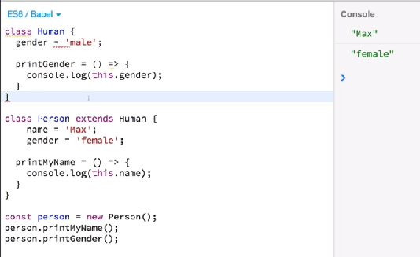
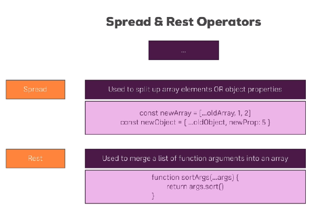

- ## [1 let and const](#1_let_and_const)
- ## [1 Arrow functions](#2_Arrow_functions)
- ## [3 Exports and imports](#3_Exports_and_imports)
- ## [4 Understanding classes](#4_Understanding_classes)
- ## [5 The spread and rest operator](#5_spread_and_rest)
- ## [6 Destructuring](#6_destructuring)
- ## [7 Reference and primitive types](#7_reference_and_primitive_types)
- ## [8 Refreshing array functions](#8_refreshing_array_functions)

# <a name="1_let_and_const"></a>1 let and const
let is the new var
const cannot be assigned a new value but it can change if it is an array holding a series of values

# <a name="2_Arrow_functions"></a>1 Arrow functions

```js
// 1 argument
const printMyName = name => {
    console.log(name);
}
// More than one argument
const printMyNameAndAge = (name, age) => {
    console.log(name, age);
}
// If you have a single return you can ommit curly braces and return keyword and write it in one line
const printMyName = name => console.log(name);
```

# <a name="3_Exports_and_imports"></a>3 Exports and imports


# <a name="4_Understanding_classes"></a>4 Understanding classes

With classes you can define blueprints for javascript objects. It is one of two ways react uses to create components.  If you are using the older syntax you need to include the **super()** keyword if you are extending a class and want to call its constructor properly. There is an older syntax and a next gen syntax of using classes.

Older syntax:


Next gen syntax:


# <a name="5_spread_and_rest"></a>5 The spread and rest operator



Spread on arrays:
```js
const numbers = [1, 2, 3];

const newNumbers = [...numbers, 4];

console.log(newNumbers);
// [1, 2, 3, 4]
```
Spread on objects:
```js
const person = {
    name: "warwick"
};

const newPerson = {
    ...person,
    age: 29
}

console.log(newPerson);
// newPerson: { name: "warwick", age: 29}
```
Rest operator:
```js
const filter = (...args) => {
    return args.filter(el => el === 1);
}

console.log(filter(1, 2, 3));
// [1]
```

# <a name="6_destructuring"></a>6 Destructuring

Destructuring array elements 9r 9buect

```js
const numbers = [1, 2, 3];
[num1, num2] = numbers;
console.log(num1, num2);
// 1
// 2
[num1, , num3] = numbers
console.log(num1, num3)
// 1
// 3
```

# <a name="7_reference_and_primitive_types"></a>7 Reference and primitive types

# <a name="8_refreshing_array_functions"></a>8 Refreshing array functions