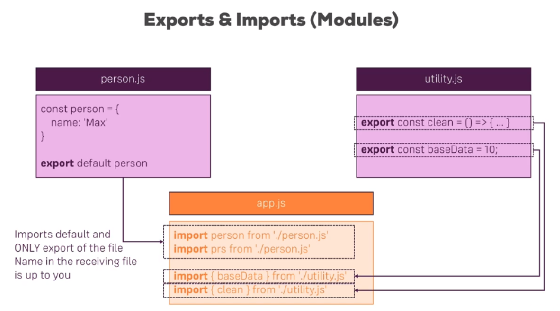
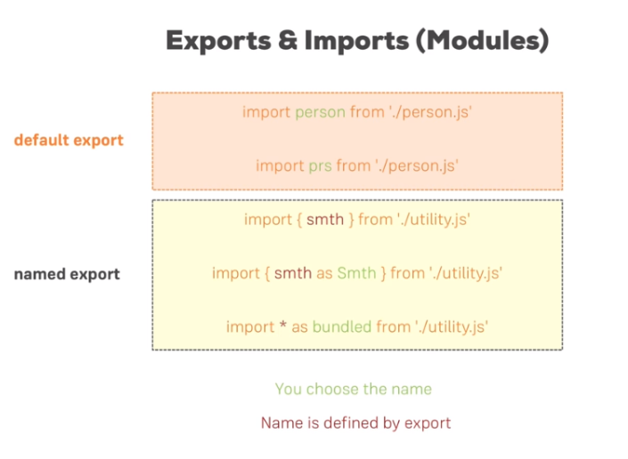
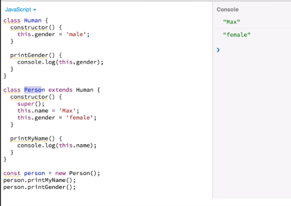
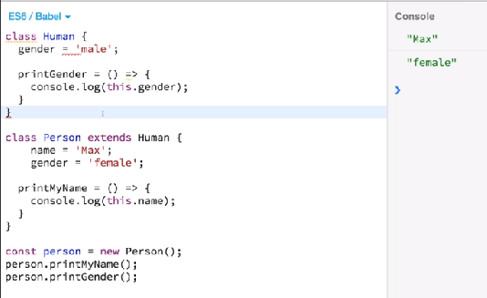
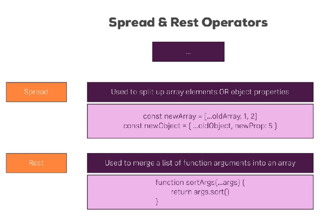

---
<a name="Back_To_Top"></a> Top
---

- ## [1 let and const](#1_let_and_const)
- ## [1 Arrow functions](#2_Arrow_functions)
- ## [3 Exports and imports](#3_Exports_and_imports)
- ## [4 Understanding classes](#4_Understanding_classes)
- ## [5 The spread and rest operator](#5_spread_and_rest)
- ## [6 Destructuring](#6_destructuring)
- ## [7 Reference and primitive types](#7_reference_and_primitive_types)
- ## [8 Refreshing array functions](#8_refreshing_array_functions)

---

# <a name="1_let_and_const"></a>1 let and const

let is the new var
const cannot be assigned a new value but it can change if it is an array holding a series of values

---

- [Top](#Back_To_Top)

---

# <a name="2_Arrow_functions"></a>1 Arrow functions

```js
// 1 argument
const printMyName = (name) => {
  console.log(name);
};
// More than one argument
const printMyNameAndAge = (name, age) => {
  console.log(name, age);
};
// If you have a single return you can ommit curly braces and return keyword and write it in one line
const printMyName = (name) => console.log(name);
```

---

- [Top](#Back_To_Top)

---

# <a name="3_Exports_and_imports"></a>3 Exports and imports

Lets take a look at the disadvantages of not using modular code:

| Approach              | Disadvantage                       | Description                                                                                            |
| --------------------- | ---------------------------------- | ------------------------------------------------------------------------------------------------------ |
| Inline                | Lacks code reusability             | Need to copy it to other pages                                                                         |
| .                     | Pollutes the global namespace      | Can only declare `var a` once                                                                          |
| .                     | .                                  | .                                                                                                      |
| Script tags           | Lacks code reusability             | Need to copy paste script tags                                                                         |
| .                     | Pollutes the global namespace      | Can only declare `var a` once                                                                          |
| .                     | Lack of dependency resolution      | A JS script dependant on JQuery would need to be imported after the JQuery script                      |
| .                     | .                                  | .                                                                                                      |
| IIFE's                | Pollutes the global namespace once | The variable used as entry point still pollutes the global namespace                                   |
| .                     | Lack of dependency resolution      | The order of scripts still matter                                                                      |
| .                     | .                                  | .                                                                                                      |
| Browserify/Package.js | Code needs to be bundled           | CommonJS syntax : JS1: module.exports = function add(a, b){return a+b} JS2: var add = require('./add') |

### ES6 Exports and Imports to the rescue!

Exports and imports allow us to write _modular_ code. This _modular_ code is simply JS code which gets split up over multiple files. Naturally we can already split our code over multiple files - we just have to import them in the correct order in our html.

> ### Inside of a JS file we can import content from another file so that the JS files themselves know their dependencies.



- The example on the left is a `default` export. `default` being a special keyword marking the content as the `default` export of the file. Since we are using a default export we can give it any name when importing.

- The example on the right uses "named exports" which limit your import statements to the exact name used by the constant.
  The example above can also add option where the import is done on one line.

  ```js
  import { baseData, clean } from './utility.js';
  ```



---

- [Top](#Back_To_Top)

---

# <a name="4_Understanding_classes"></a>4 Understanding classes

With classes you can define blueprints for javascript objects. It is one of two ways react uses to create components. If you are using the older syntax you need to include the **super()** keyword if you are extending a class and want to call its constructor properly. There is an older syntax and a next gen syntax of using classes.

Older syntax:



Next gen syntax:



---

- [Top](#Back_To_Top)

---

# <a name="5_spread_and_rest"></a>5 The spread and rest operator



Spread on arrays:

```js
const numbers = [1, 2, 3];

const newNumbers = [...numbers, 4];

console.log(newNumbers);
// [1, 2, 3, 4]
```

Spread on objects:

```js
const person = {
  name: 'warwick',
};

const newPerson = {
  ...person,
  age: 29,
};

console.log(newPerson);
// newPerson: { name: "warwick", age: 29}
```

Rest operator:

```js
const filter = (...args) => {
  return args.filter((el) => el === 1);
};

console.log(filter(1, 2, 3));
// [1]
```

---

- [Top](#Back_To_Top)

---

# <a name="6_destructuring"></a>6 Destructuring

Destructuring array elements 9r 9buect

```js
const numbers = [1, 2, 3];
[num1, num2] = numbers;
console.log(num1, num2);
// 1
// 2
[num1, , num3] = numbers;
console.log(num1, num3);
// 1
// 3
```

---

- [Top](#Back_To_Top)

---

# <a name="7_reference_and_primitive_types"></a>7 Reference and primitive types

In Javascript strings, numbers, booleans are primitive types whereas objects and arrays are reference types. These types have important implications when create copies of variables.

Reference types simply copy a

```js
const person = { name: 'Warwick' };

const secondPerson = person;

person.name = 'Mientel';

console.log(secondPerson.name);
// Mientel
```

> ### In this case the reason `secondPerson` was also updated is because we've copied the pointer which points to the exact same object in memory as `person` does. This is the same for arrays and is important to keep in mind because it can lead to unexpected errors in React.

Lets take a look at how we can create a copy in an immutable way which means we copy the actual contents and not just the pointer.

> ### We achieve this by using the **spread** operator.

```js
const person = { name: 'Warwick' };

const secondPerson = {
  ...person,
};

person.name = 'Mientel';

console.log(secondPerson.name);
// Warwick
```

---

- [Top](#Back_To_Top)

---

# <a name="8_refreshing_array_functions"></a>8 Refreshing array functions

The following page gives a good overview over the various methods you can use on the array prototype - feel free to click through them and refresh your knowledge as required:

https://developer.mozilla.org/en-US/docs/Web/JavaScript/Reference/Global_Objects/Array

`map()` => https://developer.mozilla.org/en-US/docs/Web/JavaScript/Reference/Global_Objects/Array/map

`find()` => https://developer.mozilla.org/en-US/docs/Web/JavaScript/Reference/Global_Objects/Array/find

`findIndex()` => https://developer.mozilla.org/en-US/docs/Web/JavaScript/Reference/Global_Objects/Array/findIndex

`filter()` => https://developer.mozilla.org/en-US/docs/Web/JavaScript/Reference/Global_Objects/Array/filter

`reduce()` => https://developer.mozilla.org/en-US/docs/Web/JavaScript/Reference/Global_Objects/Array/Reduce?v=b

`concat()` => https://developer.mozilla.org/en-US/docs/Web/JavaScript/Reference/Global_Objects/Array/concat?v=b

`slice()` => https://developer.mozilla.org/en-US/docs/Web/JavaScript/Reference/Global_Objects/Array/slice

`splice()` => https://developer.mozilla.org/en-US/docs/Web/JavaScript/Reference/Global_Objects/Array/splice

---

- [Top](#Back_To_Top)

---
