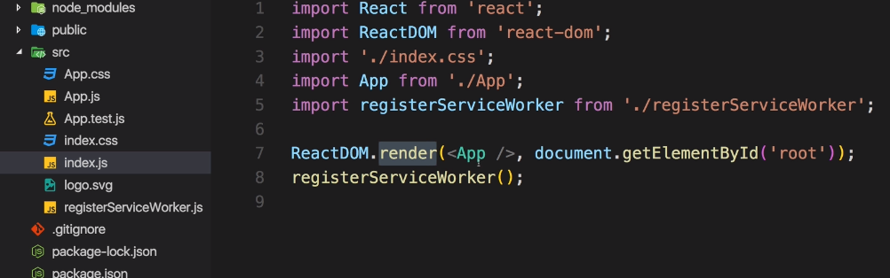

---
<a name="Back_To_Top"></a> Top
---

# Understanding the Base Features & Syntax

- ## [The Build Workflow](#The_Build_Workflow)
- ## [Using Create React App](#Using_Create_React_App)
- ## [Understanding Folder Structure](#Understanding_Folder_Structure)
- ## [Component Basics](#Component_Basics)

- ## [JSX & JSX Restrictions](#JSX_&_JSX_Restrictions)
- ## [Creating a Functional Component](#Creating_a_Functional_Component)
- ## [Outputting Dynamic Content in Components](#Outputting_Dynamic_Content_in_Components)
- ## [Working with `props` and `props.children`](#Working_with_Props)

- ## [Understanding & using `setState()` in Class Based Components](<#Understanding_&_using_`setState()`_in_Class_Based_Components>)
- ## [Using the `useState()` Hook for component manipulation in a **functional** component](<#Using_the_useState()_Hook_for_component_manipulation_in_a_**functional**_component>)

- ## [Stateless vs Stateful Components](#Stateless_vs_Stateful_Components)

- ## [Passing Method References between components](#Passing_Method_References_between_components)
- ## [Adding Two Way Binding](#Adding_Two_Way_Binding)

---

# <a name="The_Build_Workflow"></a> The Build Workflow

For _Single Page Applications_ (SPA) & _Multi Page Applications_ (MPA) we need a more complex workflow. Below are some of the reasons **why** and **how** it is achieved.


1. Why do we need such a workflow?

- Optimise

For a large application we want to ship code that is as small and as optimised as possible because it increases the performance of our app.

- Use next-generation JS features

Its the defacto standard for React to use the next-gen JS features and these features make our lives easier as a developer. The code is leaner, easier to read, faster and less error-prone. We also need a build workflow which compiles these features to make it compatible with older browsers.

- More productive

This includes the use of ES6 but also includes things like _CSS auto prefixing_. CSS prefixes are used to achieve the broadest possible browser support for CSS features. Also linting is a tool which warns you when you are writing sub-optimal code. All these things are part of a build workflow.

2. How do we achieve such a workflow?

- Use dependency management tool (npm or yarn)

_Dependencies_ are third party libraries (third party JS packages). `React`, `React-DOM`, the compiler for next-gen to current-gen JS are all _dependencies_. To manage these _dependencies_ we will use Node Package Manager which is the de-facto front-end management tool for these packages.

- Bundler (Webpack recommended)

We need a _bundler_ because we want to write modular code and split it over multiple files so that each file has a clear task and focus. When the code is shipped we however want to bundle this code together because older browsers don't support split-up files and it might not be that optimal to make requests to all these tiny focused files. **Webpack** is the defacto standard for bundling these days. It doesn't only bundle files, it also allows us to apply some other build steps before it does this bundling such as the compilation of next-gen JS to current-gen JS.

- Use compiler: Babel + presets

Babel is a compiler which does the JS compilation from next-gen to current-gen JS. Which means translating from modern features to workarounds which also run on older browsers. For this we use **Babel + presets** which can be hooked into the Webpack configuration so that they are part of the bundling/optimisation process.

- Use development server

We want to use a development server to test our app locally on our machine. This is a webserver which runs **locally** on our machine to test our code.

There is a tool known as **create react app** which can be used to setup such as a workflow app.

---

- [Top](#Back_To_Top)

---

# <a name="Using_Create_React_App"></a> Using Create React App

`npm install create-react-app -g`

`create-react-app react-complete-guide`

`create-react-app react-complete-guide --scripts-version 1.1.5`

    npm start

Launches dev server

---

- [Top](#Back_To_Top)

---

# <a name="Understanding_Folder_Structure"></a> Understanding Folder Structure


On the root level there are a couple of files.

- 1 `package-lock.json` files can be ignored - they are simply locking in the version of the dependencies we are using

- 2 `manifest.json` is there because create-react-app gives us a progressive webapp out of the box (a basic one at least) and gives us the manifest.json where we can define some metadata about our application.

- 3 `package.json` is where our general dependencies are stored and this was all created by **create-react-app**.


`"react"` & `"react-dom"` refer to the current version of react we are using and `"react-scripts"` is offering all the features of the build workflow such as development server, next-gen JS and all these things we are using in the project.

There are also a couple of scripts defined which can be run with `npm run`, the exception being start which can be run with `npm start`. The `build` script will create our build folder which optimises our code.

- 4 `node_modules` holds all dependencies and sub-dependencies of our project. Remember `react-scripts` has a lot of other dependencies with lots of little build tools which compiles code and so on.

- 5 `public` folder is the root folder which gets served by the webserver in the end though here it only holds the files we can edit. The script files are edited in the `src` folder.


The most important file is the `index.html` file which is the only html page we will ever have here. This is where our script files get injected. You can edit this file but you cannot write any JS code here. This is also where we can import external libraries or link files such as CSS files and you can also edit `meta` tags here if you wish to.

- 6 `src` folder contains the files we will work in and is actually where our React app exists.



Most important for us right now is the `index.js` file which gets access to the `root` element in our DOM (in our html file). It uses the `render()` method to render our only existing component, the `App` component to our `root` element.

The `App.css` file contains globals styling which is not scoped to our index.js file. The `index.css` file also contains global styling and should be used for some general setup of our application.

The `registerServiceWorker.js` file registers a service worker and is generated automatically and is related to this progressive webapp we get out of the box. It precaches our script files. We don't need to make any configurations there.

The `app.test.js` file is for unit testing components.

---

- [Top](#Back_To_Top)

---

# <a name="Component_Basics"></a> Component Basics

React is all about making components. In the **App.js** file we see the primary react component.

It is a Javascript class named `App` which inherits from the imported `Component` class from the react library. Additionally we must always import `React` into our components. Every React component has to return some html code which can be rendered to the DOM. This is actually known as JSX - not html and its the reason for importing `React` to compile the JSX.

The `App` component is then exported as the default export.

**src -> App.js**

```js
import React, { Component } from 'react';
import logo from './logo.svg';
import './App.css';

class App extends Component {
  render() {
    return (
      <div className="App">
        <div className="App-header">
          
          <h2>Welcome to React</h2>
        </div>
        <p className="App-intro">
          To get started, edit <code>src/App.js</code> and save to reload.
        </p>
      </div>
    );
  }
}

export default App;
```

This **App** component is imported into the `index.js` file where it gets rendered into the place of the root element. Inside of this app component we will nest all the other components our application might need. We can also nest other components into eachother but there will always only be one root `App` component.

**src -> index.js**

```js
import React from 'react';
import ReactDOM from 'react-dom';
import App from './App';
import './index.css';

ReactDOM.render(<App />, document.getElementById('root'));
```

---

- [Top](#Back_To_Top)

---

# <a name="JSX_&_JSX_Restrictions"></a> JSX & JSX Restrictions

JSX is different from regular html. JSX is just syntactic sugar for JavaScript, allowing you to write HTMLish code instead of nested `React.createElement(...)` calls.

1. We cannot use the word class we need to use **className**.

2. It is also a convention to wrap everything in a single div.

**src -> App.js**

```js
import React, { Component } from 'react';
import logo from './logo.svg';
import './App.css';

class App extends Component {
  render() {
    return (
      // Notice parenthesis
      <div className="App">
        {' '}
        // Wrapping div
        <div className="App-header">
           // className
          <h2>Welcome to React</h2>
        </div>
        <p className="App-intro">
          To get started, edit <code>src/App.js</code> and save to reload.
        </p>
      </div>
    ); // Notice parenthesis
  }
}

export default App;
```

---

- [Top](#Back_To_Top)

---

# <a name="Creating_a_Functional_Component"></a> Creating a Functional Component

When creating components, you have the choice between two different ways:

## 1. Functional components (using ES6 arrow functions as shown here is recommended but optional)

```js
const cmp = () => {
  return <div>some JSX</div>;
};
```

---

- [Top](#Back_To_Top)

---

## 2. Class-based components

```js
class Cmp extends Component {
  render() {
    return <div>some JSX</div>;
  }
}
```

In React its a convention to create **folder names for components with starting capital letters** along with **component file names which match this name**.

Most of the time the best way to create a component is by creating a simple functional component.  
Remember that to return our JSX we need to import react from the react package.

Person folder -> Person.js

```js
import React from 'react';

const person = () => {
  return <h1>I'm a person</h1>;
};

export default person;
```

Now in the App.js file we import our person component and **components always need to start with an Uppercase character** so as to not interfere with the JSX.  
We can either import it with a closing tag `<Person></Person>` or since we have nothing in between a single tag `<Person />`.
We can import the component multiple times but copy pasting the component.

**src -> App.js**

```js
import React, { Component } from 'react';
import logo from './logo.svg';
import './App.css';
import Person from './Person/Person';

class App extends Component {
  render() {
    return (
      <div className="App">
        <h2>I'm a React App</h2>
        <Person />
      </div>
    );
  }
}

export default App;
```

---

- [Top](#Back_To_Top)

---

# <a name="Ouputting_Dynamic_Content_in_Components"></a> Outputting Dynamic Content in Components

Al though we can't define a Javascript class in our JSX we can define short simple expressions such as calculations or function calls which could do more complex stuff.

**Person -> Person.js**

```js
import React from 'react';

const person = () => {
  return (
    <h1>I'm a person who is {Math.floor(Math.random() * 30)} years old.</h1>
  );
};

export default person;
```

---

- [Top](#Back_To_Top)

---

# <a name="Working_with_Props"></a> Working with `props` and `props.children`

Its possible to pass dynamic content to components from outside as props. Props allow you to pass data from a parent (wrapping) component to a child (embedded) component.

> Note that we can also pass **complex `html` content** between the opening and closing tags of our components.

**src -> App.js**

```js
import React, { Component } from 'react';
import logo from './logo.svg';
import './App.css';
import Person from './Person/Person';

class App extends Component {
  render() {
    return (
      <div className="App">
        <h2>I'm a React App</h2>
        <Person name="Leon" age="58" />
        <Person name="Warwick" age="29">
          Hobbies: coding
        </Person>
      </div>
    );
  }
}

export default App;
```

In our component `props` is passed as a parameter where `props.children` refers to the html content passed in between our component tags in the parent. Since we are passing more content now we will **add opening and closing brackets** to our return statement and wrap our code in a div.

Person folder -> Person.js

```js
import React from 'react';

const person = (props) => {
  return (
    <div>
      <h1>
        I'm a person my name is {props.name} and I am {props.age} years old.
      </h1>
      <h1>{props.children}</h1>
    </div>
  );
};

export default person;
```

---

- [Top](#Back_To_Top)

---

# <a name="Understanding_&_using_`setState()`_in_Class_Based_Components"></a> Understanding & using `setState()` in Class Based Components

The state property is **only available in class based components** which extend the `component` component. Its recommended to use functional components as often as possible because if we are managing state everywhere our app can quickly become messy as it grows.
_This doesn't mean that we shouldn't use it at all though!_

Whenever our components `state` changes it will lead to the DOM being rerendered with our updated state. The only other thing that rerenders the DOM are changes in props.

Since we are extending the `component` class we are granted access to its `setState()` method which we can use to change our state. `setState()` takes an object as an argument and will merge with our state whatever is entered. Note that since we are not saying anything about the prop `otherState` in our state, it will remain untouched.

> Note that with React Hooks its possible to also manage state in functional components.

**src -> App.js**

```js
import React, { Component } from 'react';
import logo from './logo.svg';
import './App.css';
import Person from './Person/Person';

class App extends Component {

  state = {
    persons: [
      { name: "Warwick", age: 29 },
      { name: "Leon", age: 58 }
    ],
    othersState: "some other value"
  }

  const switchNameHander = () => {
    this.setState({
      persons: [
        { name: "Warwick", age: 29 },
        { name: "Mientel", age: 57 }
      ]
    })
  }

  render() {
    return (
      <div className="App">
          <h2>I'm a React App</h2>
          <button onClick={this.switchNameHandler}>Switch Name</button>
          <Person name={this.state.persons[0].name} age={this.state.persons[0].age}>Hobbies: coding</Person>
          <Person name={this.state.persons[1].name} age={this.state.persons[1].age}/>
      </div>
    );
  }
}

export default App;
```

> ### Notice that `switchNameHandler` is not invoked with `()` inside of the JSX. We are simply passing a reference to be used upon a click event.

---

- [Top](#Back_To_Top)

---

# <a name="Using_the_useState()_Hook_for_component_manipulation_in_a_**functional**_component"></a> Using the `useState()` Hook for component manipulation in a **functional** component

_Prior to React 16.8 (before React Hooks was introduced) all apps were built using the class based state approach so many companies have software built on this approach._

Lets change our `App` component to a **functional** one by converting it to an arrow function and changing the export to match the lowercase `app` naming. We also remove the `render()` method (_only class based components_) and our `Component` class import and replace it with a `useState` import.

> `useState` is the hook which allows us to manage React Hooks in our **functional** component.

`useState` is a function to which we can pass our state object. This function **ALWAYS** returns **EXACTLY TWO** elements. Thus, we can store our state array in a `stateArray` constant. The first element will always be our current state and the second element will always be a function which allows us to update our state in a way that React is aware of it.

We can also use a more modern JS feature called **array destructuring** by replacing our `stateArray` constant with an `array` to pull out elements from the right side of the equal sign using the values in the left sides array.

So we will need to replace all the `this.state` (_only class based components_) calls with `personsState` since it now serves as the new reference to our state.

Functions are still used but it has to refer to our `setPersonsState` value from **array destructuring** its fine to have a function inside of a function as is the case with our `app` function and `switchNameHandler` below.

**src -> App.js**

```js
import React, { useState } from 'react';
import logo from './logo.svg';
import './App.css';
import Person from './Person/Person';

const app = (props) => {
  const [personsState, setPersonsState] = useState({
    persons: [
      { name: 'Warwick', age: 29 },
      { name: 'Leon', age: 58 },
    ],
    //othersState: "some other value"
  });

  const [someOtherState, setSomeOtherState] = useState({
    otherState: 'some other value',
  });

  //Its allowed to also just be a straight up string

  // const [someOtherState, setSomeOtherState] = useState(
  //    "some other value"
  // )

  const switchNameHander = () => {
    setPersonsState({
      persons: [
        { name: 'Warwick', age: 29 },
        { name: 'Mientel', age: 57 },
      ],
      // othersState: personsState.otherState // Would need to include this if it was part of our state above
    });
  };

  return (
    <div className="App">
      <h2>I'm a React App</h2>
      <button onClick={switchNameHandler}>Switch Name</button>

      <Person
        name={personsState.persons[0].name}
        age={personsState.persons[0].age}
      >
        Hobbies:coding
      </Person>

      <Person
        name={personsState.persons[1].name}
        age={personsState.persons[1].age}
      />
    </div>
  );
};

export default app;
```

An important thing to note about functional components and changing state is that it \*does not merge with our original state but instead **replaces our state\***. For this reason we created two `useState()` methods as above.

> ### We have two options: We can either include our other state properties in the setState method we are using OR for \*functional components we are allowed to have **multiple `useState()` hooks\***. `Using multiple`useState()`hooks is the more elegant way of doing it.`

> ### In contrast with class based components `this.setState()` can configure individual properties within our state. _I think this is more powerful._

---

- [Top](#Back_To_Top)

---

# <a name="Stateless_vs_Stateful_Components"></a> Stateless vs Stateful Components

Whether you are creating a class based component with the `state` property & `this.setState()` or as a functional component with the `useState()` hook **you can differentiate your components as _stateful_ and _stateless_ components**

- 1 _Stateful_ (aka _container_ or _smart_) components are components which manage state.

- 2 _Stateless_ (aka _presentation_ or _dumb_) components are components which **don't** manage state.

> ### Use stateless components as much as possible to keep the flow of the application simple to understand.

---

- [Top](#Back_To_Top)

---

# <a name="Passing_Method_References_between_components"></a> Passing Method References between components

Its possible to also pass functions as props. For this we create a **property** (can be any name) where we pass the function reference to our child component.

When passing a parameter to the function there is two syntax variations we can use. The first passes an anonymous function call and is less efficient - the second uses `bind` keyword and is the recommended approach.

1. `<button onClick={() => this.switchNameHandler("Maximilian!!")}>`

2. `click={this.switchNameHandler.bind(this, "Max!")}`

The code below demonstrates implementations of these syntax variations.

**src -> App.js**

```js
import React, { Component } from 'react';
import './App.css';
import Person from './Person/Person';

class App extends Component {
  state = {
    persons: [
      { name: 'Max', age: 28 },
      { name: 'Manu', age: 29 },
      { name: 'Stephanie', age: 26 },
    ],
    otherState: 'some other value',
  };

  switchNameHandler = (newName) => {
    // DON'T DO THIS: this.state.persons[0].name = 'Maximilian'; // Always change state via this.setState({})
    this.setState({
      persons: [
        { name: newName, age: 28 },
        { name: 'Manu', age: 29 },
        { name: 'Stephanie', age: 27 },
      ],
    });
  };

  render() {
    return (
      <div className="App">
        <h1>Hi, I'm a React App</h1>
        <p>This is really working!</p>
        <button onClick={() => this.switchNameHandler('Maximilian!!')}>
          Switch Name
        </button>
        <Person
          name={this.state.persons[0].name}
          age={this.state.persons[0].age}
        />
        <Person
          name={this.state.persons[1].name}
          age={this.state.persons[1].age}
          click={this.switchNameHandler.bind(this, 'Max!')}
        >
          My Hobbies: Racing
        </Person>
        <Person
          name={this.state.persons[2].name}
          age={this.state.persons[2].age}
        />
      </div>
    );
    // return React.createElement('div', {className: 'App'}, React.createElement('h1', null, 'Does this work now?'));
  }
}

export default App;
```

In our child component we access the reference using an `onClick` event and the `click` property in our `props` which contains a reference to the `switchNameHandler` function.

**_Person -> Person.js_**

```js
import React from 'react';

const person = (props) => {
  return (
    <div>
      <p onClick={props.click}>
        I'm {props.name} and I am {props.age} years old!
      </p>
      <p>{props.children}</p>
    </div>
  );
};

export default person;
```

---

- [Top](#Back_To_Top)

---

# <a name="Adding_Two_Way_Binding"></a> Adding Two Way Binding

Lets setup two way binding by creating an input, displaying the current value of our state in that input and dynamically listening for changes on the input which updates our state. We do so by setting up an `onChange` event handler which is passed a function reference that updates our state when a change occurs.

**src -> App.js**

```js
import React, { Component } from 'react';
import './App.css';
import Person from './Person/Person';

class App extends Component {
  state = {
    persons: [
      { name: 'Max', age: 28 },
      { name: 'Manu', age: 29 },
      { name: 'Stephanie', age: 26 },
    ],
    otherState: 'some other value',
  };

  switchNameHandler = (newName) => {
    this.setState({
      persons: [
        { name: newName, age: 28 },
        { name: 'Manu', age: 29 },
        { name: 'Stephanie', age: 27 },
      ],
    });
  };

  nameChangedHandler = (event) => {
    this.setState({
      persons: [
        { name: 'Max', age: 28 },
        { name: event.target.value, age: 29 },
        { name: 'Stephanie', age: 26 },
      ],
    });
  };

  render() {
    return (
      <div className="App">
        <h1>Hi, I'm a React App</h1>
        <p>This is really working!</p>
        <button onClick={() => this.switchNameHandler('Maximilian!!')}>
          Switch Name
        </button>
        <Person
          name={this.state.persons[1].name}
          age={this.state.persons[1].age}
          click={this.switchNameHandler.bind(this, 'Max!')}
          changed={this.nameChangedHandler}
        >
          My Hobbies: Racing
        </Person>
      </div>
    );
  }
}

export default App;
```

In our `Person` component the input has a value property containing our `props.name`. We use the `onChange` method which is calling our function reference to update our state.

> ### If we were outputting `props.name` to our inputs value without providing an `onChange` method we would run into problems because we **would not be able to change the value of our input** thus locking it down.

**_Person -> Person.js_**

```js
import React from 'react';

const person = (props) => {
  return (
    <div>
      <p onClick={props.click}>
        I'm {props.name} and I am {props.age} years old!
      </p>
      <p>{props.children}</p>
      <input type="text" onChange={props.changed} value={props.name} />
    </div>
  );
};

export default person;
```

---

- [Top](#Back_To_Top)

---
