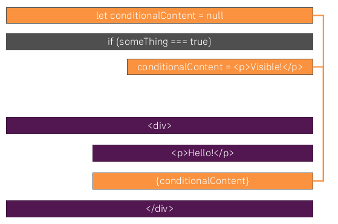

---
<a name="Back_To_Top"></a> Top
---

- ### [Rendering Content Conditionally](#Rendering_Content_Conditionally)

---

## <a name="Rendering_Content_Conditionally"></a>Rendering Content Conditionally

There are two approaches for rendering conditional content in React.

1. We can evaluate the JSX we want to render using a Javascript ternary statement within the JSX we are returning.

2. Setting a variable to `null` and using an `if` statement to evaluate whether or not to render the JSX within our return statement using curly brace syntax.

> ### Method 1: **Rendering Content Conditionally**

**src -> App.js**

```js
import React, { Component } from "react";
import "./App.css";
import Person from "./Person/Person";

class App extends Component {
  state = {
    persons: [
      { name: "Max", age: 28 },
      { name: "Manu", age: 29 },
      { name: "Stephanie", age: 26 },
    ],
    otherState: "some other value",
    showPersons: false,
  };

  togglePersonsHandler = () => {
    const doesShow = this.state.showPersons;
    this.setState({ showPersons: !doesShow });
  };

    return (
      <div className="App">
        <h1>Hi, I'm a React App</h1>
        <p>This is really working!</p>
        <button onClick={this.togglePersonsHandler}>
          Toggle Persons
        </button>
        {
          this.state.showPersons ?
            <div>
              <Person
                name={this.state.persons[0].name}
                age={this.state.persons[0].age}
              />
              <Person
                name={this.state.persons[1].name}
                age={this.state.persons[1].age}
              >
                My Hobbies: Racing
              </Person>
              <Person
                name={this.state.persons[2].name}
                age={this.state.persons[2].age}
              />
            </div> : null
        }
      </div>
    );
  }
}

export default App;
```

> ### Method 2: **Handling Dynamic Content "The Javascript Way"**



**src -> App.js**

```js
import React, { Component } from "react";
import "./App.css";
import Person from "./Person/Person";

class App extends Component {
  state = {
    persons: [
      { name: "Max", age: 28 },
      { name: "Manu", age: 29 },
      { name: "Stephanie", age: 26 },
    ],
    otherState: "some other value",
    showPersons: false,
  };

  togglePersonsHandler = () => {
    const doesShow = this.state.showPersons;
    this.setState({ showPersons: !doesShow });
  };

    let persons = null;

    if (this.state.showPersons) {
      persons = (
        <div>
          <Person
            name={this.state.persons[0].name}
            age={this.state.persons[0].age}
          />
          <Person
            name={this.state.persons[1].name}
            age={this.state.persons[1].age}
          >
            My Hobbies: Racing
          </Person>
          <Person
            name={this.state.persons[2].name}
            age={this.state.persons[2].age}
          />
        </div>
      );
    }

    return (
      <div className="App">
        <h1>Hi, I'm a React App</h1>
        <p>This is really working!</p>
        <button onClick={this.togglePersonsHandler}>
          Toggle Persons
        </button>
        {persons}
      </div>
    );
  }
}

export default App;
```

---

- [Top](#Back_To_Top)

---

- ### [1 TEMPLATE](#1_TEMPLATE)

## <a name="1_TEMPLATE"></a>1 TEMPLATE

- ### [1 TEMPLATE](#1_TEMPLATE)

## <a name="1_TEMPLATE"></a>1 TEMPLATE

[Table Lookups -> nwId](https://github.com/WNortier/nextworld/blob/master/nextworld-platform-tutorials/01-build-an-application/00-build-an-application-overview.md#3_TABLE_LOOKUPS)

> ### The `key` property is an important property to add when rendering lists of data. This `key` property helps react update a list efficiently. Defining the `key` property helps react to understand which elements have changed when rerendering and updating the DOM.
