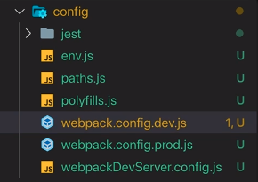
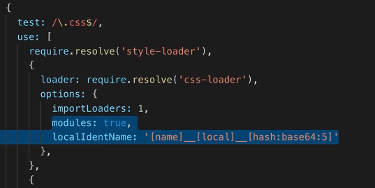

---
<a name="Back_To_Top"></a> Top
---

- ### [Adding Styling with Stylesheets or Inline Styles](#Adding_Styling_with_Stylesheets_or_Inline_Styles)
- ### [Setting Styles Dynamically](#Setting_Styles_Dynamically)
- ### [Setting classNames Dynamically](#Setting_classNames_Dynamically)
- ### [Working with Styled Components](#Working_with_Styled_Components)
- ### [Working with Radium](#Working_with_Radium)
- ### [Working with CSS Modules](#Working_with_CSS_Modules)

---

# <a name="Adding_Styling_with_Stylesheets_or_Inline_Styles"></a> Adding Styling with Stylesheets or Inline Styles

- Thanks to webpack we can import our css files into our Javascript files. This way the file will become aware of the css associated with it.

- We can add inline styles using an object literal and embed it in the JSX using curly brace syntax. However, complex styling such as hover effects is a little tricky to achieve with inline styles.

- Inline styles have the added benefit of being scoped to the component they are being applied to, but they have certain restriction as they are unable to leverage the full power of css and they bloat your js file.

**src -> Person.css**

```css
.Person {
  width: 60%;
  margin: auto;
  border: 1px solid #eee;
  box-shadow: 0 wpx 3px #ccc;
  padding: 16px;
  text-align: center;
}
```

**src -> Person.js**

```js
import React from 'react';
import './Person.css';

const style = {
  // Instantiating the style object
  backgroundColor: 'white',
  border: '1px solid blue',
  padding: '5px',
  font: 'inherit',
};

const person = (props) => {
  return (
    // Assigning the inline style object to the button
    <div>
      <p onClick={props.click}>
        I'm {props.name} and I am {props.age} years old!
      </p>
      <p>{props.children}</p>
      <input
        style={style}
        type="text"
        onChange={props.changed}
        value={props.name}
      />
    </div>
  );
};

export default person;
```

---

- [Top](#Back_To_Top)

---

## <a name="Setting_Styles_Dynamically"></a>Setting Styles Dynamically

Once again, react simply uses Javascript, setting styles dynamically is as simple as adjusting an object in conjunction with some kind of conditional.

**src -> App.js**

```js
import React, { Component } from 'react';
import './App.css';
import Person from './Person/Person';

class App extends Component {
  state = {
    persons: [
      { id: 'asfa1', name: 'Max', age: 28 },
      { id: 'vasdf1', name: 'Manu', age: 29 },
      { id: 'asdf11', name: 'Stephanie', age: 26 },
    ],
    otherState: 'some other value',
    showPersons: false,
  };

  render() {
    const style = {
      // Instantiating the style object
      backgroundColor: 'white',
      font: 'inherit',
      border: '1px solid blue',
      padding: '8px',
      cursor: 'pointer',
    };

    let persons = null;

    if (this.state.showPersons) {
      persons = (
        <div>
          {this.state.persons.map((person, index) => {
            return (
              <Person name={person.name} age={person.age} key={person.id} />
            );
          })}
        </div>
      );
      // Conditionally adding a property to the style object
      style.backgroundColor = 'red';
    }
    // Assigning the style object to the button
    return (
      <div className="App">
        <h1>Hi, I'm a React App</h1>
        <p>This is really working!</p>
        <button style={style} onClick={alert('hi')}>
          Toggle Persons
        </button>
        {persons}
      </div>
    );
  }
}

export default App;
```

---

- [Top](#Back_To_Top)

---

## <a name="Setting_classNames_Dynamically"></a>Setting classNames Dynamically

Assigning classes dynamically once again makes use of normal JS. One approach is to use an `array` to which we can either immediately assign values, or conditionally push values to the array and then `join()` those values into a `className`.

> ### You can have whatever logic you need to construct an array of classes or get a string of css classes by other means without joining an array.

**src -> App.css**

```css
.red {
  color: red;
}

.bold {
  font-weight: bold;
}
```

**src -> App.js**

```js
import React, { Component } from 'react';
import './App.css';
import Person from './Person/Person';

class App extends Component {
  state = {
    persons: [
      { id: 'asfa1', name: 'Max', age: 28 },
      { id: 'vasdf1', name: 'Manu', age: 29 },
      { id: 'asdf11', name: 'Stephanie', age: 26 },
    ],
    otherState: 'some other value',
    showPersons: false,
  };

  render() {
    let persons = null;

    if (this.state.showPersons) {
      persons = (
        <div>
          {this.state.persons.map((person, index) => {
            return (
              <Person name={person.name} age={person.age} key={person.id} />
            );
          })}
        </div>
      );

      style.backgroundColor = 'red';
    }

    const classes = []; // Instantiating the empty array

    if (this.state.persons.length <= 2) {
      classes.push('red'); // Pushing class string values conditionally
    }
    if (this.state.persons.length <= 1) {
      classes.push('bold'); // Pushing class string values conditionally
    }

    return (
      <div className="App">
        <h1>Hi, I'm a React App</h1>
        <p className={classes.join(' ')}>This is really working!</p>
        <button onClick={this.togglePersonsHandler}>Toggle Persons</button>
        {persons}
      </div>
    );
  }
}

export default App;
```

---

- [Top](#Back_To_Top)

---

## <a name="Working_with_Styled_Components"></a>Working with Styled Components

`npm install --save styled-components`

Styled components makes use of a feature known as 'tagged templates' which is available in vanilla JS as well.

```js
import styled from 'styled-components';

const Button = styled.button``;
```

So here buton is a method or function call so to speak on the styled object and instead of parenthesis with function arguments we now have backticks to which we can pass text which in turn is passed into the button method in a special way.

> ### The styled object which we import from styled-components has a method for every possible html element. `styled.div`, `styled.button`, `styled.h1` etc are all available as methods followed by double backticks.

- Every styled.element call returns a react component. This is why we can assign it to a variable (component name) and wrap it around the elements we wish to style in our JSX.
- Its possible to also store all your styled-components in separate component files, since that is what they are, and then to import them where needed.
- We use regular css syntax when using styled components, no camelCase styling.
- Pseudo selecors such as `:hover` require an ampersand `&:hover`.

_The way styled-components works is it takes the styles we assign to our elements and doesn't add them as inline styles, but instead assigns them to special style tags in the `<head></head>` section of our html document._

**What about conditional rendering?**

Take note that we can add props to our styled component wrappers and since styled-components makes use of tagged templates we can also include Javascript within the css code. This allows us to make use of conditionals such as ternary expressions.

**Person -> Person.js**

```js
import React from 'react';
// styled-components import
import styled from 'styled-components';

// Using a styled-components flavored div
const StyledDiv = styled.div`
  width: 60%;
  margin: 16px auto;
  border: 1px solid #eee;
  box-shadow: 0 2px 3px #ccc;
  padding: 16px;
  text-align: center;

  @media (min-width: 500px) {
    width: 450px;
  }
`;

const person = (props) => {
  return (
    // Wrapping our JSX with our styled-component div
    <StyledDiv>
      <p onClick={props.click}>
        I'm {props.name} and I am {props.age} years old!
      </p>
      <p>{props.children}</p>
      <input type="text" onChange={props.changed} value={props.name} />
    </StyledDiv>
  );
};

export default person;
```

**src -> App.js**

```js
import React, { Component } from 'react';
// styled-components import
import styled from 'styled-components';
import './App.css';
import Person from './Person/Person';

// Using a styled-components flavored button
const StyledButton = styled.button`
  background-color: ${(props) => (props.alt ? 'red' : 'green')};
  color: white;
  font: inherit;
  border: 1px solid blue;
  padding: 8px;
  cursor: pointer;

  &:hover {
    background-color: ${(props) => (props.alt ? 'salmon' : 'lightgreen')};
    color: black;
  }
`;

class App extends Component {
  state = {
    persons: [
      { id: 'asfa1', name: 'Max', age: 28 },
      { id: 'vasdf1', name: 'Manu', age: 29 },
      { id: 'asdf11', name: 'Stephanie', age: 26 },
    ],
    otherState: 'some other value',
    showPersons: false,
  };

  nameChangedHandler = (event, id) => {
    const personIndex = this.state.persons.findIndex((p) => {
      return p.id === id;
    });

    const person = {
      ...this.state.persons[personIndex],
    };

    // const person = Object.assign({}, this.state.persons[personIndex]);

    person.name = event.target.value;

    const persons = [...this.state.persons];
    persons[personIndex] = person;

    this.setState({ persons: persons });
  };

  deletePersonHandler = (personIndex) => {
    // const persons = this.state.persons.slice();
    const persons = [...this.state.persons];
    persons.splice(personIndex, 1);
    this.setState({ persons: persons });
  };

  togglePersonsHandler = () => {
    const doesShow = this.state.showPersons;
    this.setState({ showPersons: !doesShow });
  };

  render() {
    let persons = null;

    if (this.state.showPersons) {
      persons = (
        <div>
          {this.state.persons.map((person, index) => {
            return (
              <Person
                click={() => this.deletePersonHandler(index)}
                name={person.name}
                age={person.age}
                key={person.id}
                changed={(event) => this.nameChangedHandler(event, person.id)}
              />
            );
          })}
        </div>
      );
    }

    const classes = [];
    if (this.state.persons.length <= 2) {
      classes.push('red'); // classes = ['red']
    }
    if (this.state.persons.length <= 1) {
      classes.push('bold'); // classes = ['red', 'bold']
    }

    return (
      <div className="App">
        <h1>Hi, I'm a React App</h1>
        <p className={classes.join(' ')}>This is really working!</p>
        // Wrapping our JSX with our styled-component button
        <StyledButton
          alt={this.state.showPersons}
          onClick={this.togglePersonsHandler}
        >
          Toggle Persons
        </StyledButton>
        {persons}
      </div>
    );
  }
}

export default App;
```

---

- [Top](#Back_To_Top)

---

## <a name="Working_with_Radium"></a>Working with Radium

It would be nice to have scoped styles and to use psuedo selectors and media queries within our **inline** javascript styles.

> ### Radium works with inline styles.

For this we can add the **Radium** third party package:

`npm install --save radium`

Remember to add an import statement after the installation and to also **wrap all component exports with the Radium component** thus making it a higher order component. This is possible on both components created with `Class X extends Component` as well as functional components.

---

When we want to use transforming selectors such as media queries we need to go a step further by importing a named export `{ StyleRoot }` in conjunction with `Radium` and wrap our entire application in this `StyleRoot` component provided by Radium.

**Person -> Person.js**

```js
import React from 'react';
// Radium import
import Radium from 'radium';

import './Person.css';

const person = (props) => {
  // Making use of an inline media query thanks to Radium - however forces us to use StyleRoot
  const style = {
    '@media (min-width: 500px)': {
      width: '450px',
    },
  };
  return (
    <div className="Person" style={style}>
      <p onClick={props.click}>
        I'm {props.name} and I am {props.age} years old!
      </p>
      <p>{props.children}</p>
      <input type="text" onChange={props.changed} value={props.name} />
    </div>
  );
};

export default Radium(person);
```

**src -> App.js**

```js
import React, { Component } from 'react';
import './App.css';
// Radium & StyleRoot imports
import Radium, { StyleRoot } from 'radium';
import Person from './Person/Person';

class App extends Component {
  state = {
    persons: [
      { id: 'asfa1', name: 'Max', age: 28 },
      { id: 'vasdf1', name: 'Manu', age: 29 },
      { id: 'asdf11', name: 'Stephanie', age: 26 },
    ],
    otherState: 'some other value',
    showPersons: false,
  };

  render() {
    const style = {
      backgroundColor: 'green',
      color: 'white',
      font: 'inherit',
      border: '1px solid blue',
      padding: '8px',
      cursor: 'pointer',
      ':hover': {
        backgroundColor: 'lightgreen',
        color: 'black',
      },
    };

    let persons = null;

    if (this.state.showPersons) {
      persons = (
        <div>
          {this.state.persons.map((person, index) => {
            return (
              <Person name={person.name} age={person.age} key={person.id} />
            );
          })}
        </div>
      );
      // Making use of an inline hover pseudo selector thanks to Radium
      style.backgroundColor = 'red';
      style[':hover'] = {
        backgroundColor: 'salmon',
        color: 'black',
      };
    }

    const classes = [];
    if (this.state.persons.length <= 2) {
      classes.push('red');
    }
    if (this.state.persons.length <= 1) {
      classes.push('bold');
    }
    // Notice the StyleRoot wrapping component
    return (
      <StyleRoot>
        <div className="App">
          <h1>Hi, I'm a React App</h1>
          <p className={classes.join(' ')}>This is really working!</p>
          <button style={style} onClick={alert('hi')}>
            Toggle Persons
          </button>
          {persons}
        </div>
      </StyleRoot>
    );
  }
}

export default Radium(App);
```

---

- [Top](#Back_To_Top)

---

## <a name="Working_with_CSS_Modules"></a>Working with CSS Modules

Styled components are nice but it has the disadvantage of bloating our Javascript files and lacks certain autocompletion perks of working in a css file directly.

> ### CSS Modules allow us to scope styles to a certain file or a certain component with those files living in their own css file.

### CSS Modules with React Scripts Version 1

To use CSS Modules together with react scripts version 1, we need to tweak the configuration. Version 1 provides a starting setup which has a class based component.

`npm run eject`

This command will grant access to the underlying web pack config file. Whilst using git you may get an error that you have uncommitted changes. What you will get is a new `scripts` folder and `config` folder.

Our `package.json` file also changes and we now have way more packages. These are the packages used under the hood by create react app to give you that development server and build your app and bundle it together. It uses this configuration for webpack which is the tool used for all that.



Inside of the config folder there will be a `webpack.config.dev.js` and a `webpack.config.prod.js`

If you scroll down in the `webpack.config.dev.js` file until you find a `test:/\.css$/` thing where you will see that there is also a CSS loader and there you'll find some options. These are the options we need to tweak. Underneath `importLoaders: 1` add:



These lines may be copied and also need to be added to the `webpack.config.prod.js` file inside of the options object.

After making these tweaks we can now import our css in a different way. In our **app.js** file instead of `import './App.css'` we can use `import classes from './App.css`. We can rename `classes` to anything we want.

The build process detects our special import and understands that we don't just want to add the css as it is. Instead it looks into the css file and transforms every class name into a randomly generated unique one which are mapped as properties to the `classes` object we imported.

**Post.css**

```css
.Post {
  color: red;
}
```

**Post.js**

```js
import classes from './Post.css';

const post = () => <div className={classes.Post}>...</div>;
```

Here, `classes.Post` refers to an automatically generated Post property on the imported classes object. That property will in the end simply hold a value like `Post__Post__ah5_1`.

So your `.Post` class was automatically transformed to a different class which is unique across the application. You also can't use it accidentally in other components because you don't know the generated string! You can only access it through the classes object. And if you import the CSS file (in the same way) in another component, the classes object there will hold a Post property which yields a different (!) CSS class name. Hence it's scoped to a given component.

By the way, if you somehow also want to define a global (i.e. un-transformed) CSS class in such a .css file, you can prefix the selector with `:global`.

Example:

```css
:global .Post {
  ...;
}
```

---

- [Top](#Back_To_Top)

---
