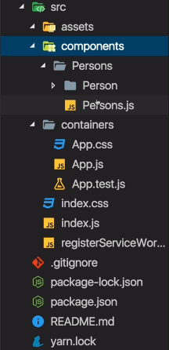
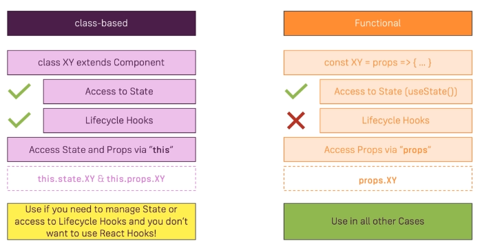
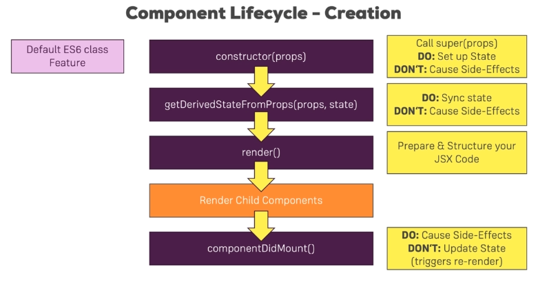

---
<a name="Back_To_Top"></a> Top
---

- ### [Splitting an App into Folders](#Splitting_an_App_into_Folders)
- ### [Splitting An App Into Components](#Splitting_An_App_Into_Components)
- ### [this.state vs this.props](#this.state_vs_this.props)
- ### [Component Lifecycle Overview](#Component_Lifecycle_Overview)
- ### [Component Creation Lifecycle](#Component_Creation_Lifecycle)

---

## <a name="Splitting_an_App_into_Folders"></a>Splitting an App into Folders

Here we have restructured our application, to only have the `index.js` file directly in the source folder then have a list of the `containers` we know and then have a list of the `components` we know.



---

- [Top](#Back_To_Top)

---

## <a name="Splitting_An_App_Into_Components"></a>Splitting An App Into Components

> ### When working with React it is the best practise to use as many functional components as possible and to create granular pieces where each component has a clear focus.

Due to the ES6 features and our project setup its possible to shorten a function body to just return parenthesis containing your JSX code and omit the `return` statement. We also `import React from 'react';` in order to render JSX.

```js
import React from 'react';

const persons = (props) => (

);
```

For our `persons.js` component we know that props w ill contain an array of persons which we want to transform into an array of JSX elements just as we previously did in `app.js`. Since we are returning `Person` here we need to import that `Person` component. All thats left to do is to adjust the functions we are receiving as props.

> ### Notice how there is no wrapping div since we are returning multiple elements sitting next to eachother.

**src -> components -> Persons -> Persons.js**

```js
import React from 'react';

import Person from './Person/Person';

const persons = (props) => {
  console.log('[Persons.js] rendering...');
  return props.persons.map((person, index) => {
    return (
      // No wrapping div
      <Person
        click={() => props.clicked(index)}
        name={person.name}
        age={person.age}
        key={person.id}
        changed={(event) => props.changed(event, person.id)}
      />
    );
  });
};

export default persons;
```

The `Cockpit` component will be a functional component. Since we won't be managing state with `usestate` we are following th best practice of using as many functional components as possible. In the `Cockpit.js` we need a wrapping element since we are returning multiple elements in our root node.

> ### There are other ways to support not having to wrap our elements in a single root because _React 16_ offers us alternatives.

Here classes must be imported and we therefore needed to create a `Cockpit.css` file

**src -> components -> Cockpit -> Cockpit.js**

```js
import React from 'react';

import classes from './Cockpit.css';

const cockpit = (props) => {
  const assignedClasses = [];
  let btnClass = '';
  if (props.showPersons) {
    btnClass = classes.Red;
  }

  if (props.persons.length <= 2) {
    assignedClasses.push(classes.red); // classes = ['red']
  }
  if (props.persons.length <= 1) {
    assignedClasses.push(classes.bold); // classes = ['red', 'bold']
  }

  return (
    <div className={classes.Cockpit}>
      <h1>{props.title}</h1>
      <p className={assignedClasses.join(' ')}>This is really working!</p>
      <button className={btnClass} onClick={props.clicked}>
        Toggle Persons
      </button>
    </div>
  );
};

export default cockpit;
```

In our `App.js` file we need to include our Persons and our Cockpit imports.

- For the Persons component we must add three props: the `persons` prop, the `clicked` prop and the `changed` prop.
- For the Cockpit component we must add three props: the `showpersons` prop, the `persons` prop and the `clicked` prop.

With that we now have a clearly focused `App.js` file with the `Cockpit` and our `Persons` components array

**src -> containers -> App.js**

```js
import React, { Component } from 'react';

import classes from './App.css';
// Importing the Persons component
import Persons from '../components/Persons/Persons';
// Importing the Cockpit component
import Cockpit from '../components/Cockpit/Cockpit';

class App extends Component {
  constructor(props) {
    super(props);
    console.log('[App.js] constructor');
  }

  state = {
    persons: [
      { id: 'asfa1', name: 'Max', age: 28 },
      { id: 'vasdf1', name: 'Manu', age: 29 },
      { id: 'asdf11', name: 'Stephanie', age: 26 },
    ],
    otherState: 'some other value',
    showPersons: false,
  };

  static getDerivedStateFromProps(props, state) {
    console.log('[App.js] getDerivedStateFromProps', props);
    return state;
  }

  componentWillMount() {
    console.log('[App.js] componentWillMount');
  }

  componentDidMount() {
    console.log('[App.js] componentDidMount');
  }

  nameChangedHandler = (event, id) => {
    const personIndex = this.state.persons.findIndex((p) => {
      return p.id === id;
    });

    const person = {
      ...this.state.persons[personIndex],
    };

    // const person = Object.assign({}, this.state.persons[personIndex]);

    person.name = event.target.value;

    const persons = [...this.state.persons];
    persons[personIndex] = person;

    this.setState({ persons: persons });
  };

  deletePersonHandler = (personIndex) => {
    // const persons = this.state.persons.slice();
    const persons = [...this.state.persons];
    persons.splice(personIndex, 1);
    this.setState({ persons: persons });
  };

  togglePersonsHandler = () => {
    const doesShow = this.state.showPersons;
    this.setState({ showPersons: !doesShow });
  };

  render() {
    console.log('[App.js] render');
    let persons = null;

    if (this.state.showPersons) {
      persons = (
        // Passing the three props to our Persons component
        <Persons
          persons={this.state.persons}
          clicked={this.deletePersonHandler}
          changed={this.nameChangedHandler}
        />
      );
    }
    // Passing the three props to our Cockpit component
    return (
      <div className={classes.App}>
        <Cockpit
          title={this.props.appTitle}
          showPersons={this.state.showPersons}
          persons={this.state.persons}
          clicked={this.togglePersonsHandler}
        />
        {persons}
      </div>
    );
  }
}

export default App;
```

---

- [Top](#Back_To_Top)

---

- ### [Comparing Stateless & Stateful Components](#Comparing_Stateless_&_Stateful_Components)

## <a name="Comparing_Stateless_&_Stateful_Components"></a>Comparing Stateless & Stateful Components

> ### Its important to note that since React 16.8 stateful does not automatically mean class-based components, though historically this has been the case because React hooks like useState are a really new feature and therefore you will find plently of applications where state is only managed in class-based components.

It remains best practice to still have many presentational components in your app. Presentational components being functional components which don't manage state and even though you can manage state using the `useState` hook you should try to restrict yourself as much as possible to functional components which don't manage state. It is best to only have a couple of components managing state and depending on the size of your app, this could be hundreds of components.

> ### The more you work with React the more you'll get a feeling for which components should manage some state so that its child components get the right inputs and which components would be better be just presentational components.

By maintaining the split between container components (stateful components) and the presentational components (dumb components) you keep your app manageable because you have a predictable flow of data since you know where your state changes and the other components are only there to render a nice ui. These ui components only define on props and that ensures that these components are highly predictable. You can throw them anywhere into your application and they work if you pass the right inputs and as your application grows you have an easier time maintaining it.

### When should you use class-based components and when should you use functional-based components?



#### Working with a version of React which doesn't support React hooks

- When you're working with state or you need lifecycle hooks, use the class-based approach otherwise go functional.

#### Working with a version of React that supports React hooks

This is less simple.

- You might want to use functional components only.
- You can also split it to have a clear separation between components that are involved with state management and components that arnt.

---

- [Top](#Back_To_Top)

---

## <a name="this.state_vs_this.props"></a>this.state vs this.props

Thus far we've only accesed `this.state` in the `App.js` when we are passing our state as props to our child components. Our `App.js` file does not receive any props, but we can change this by sending a prop into our `App.js` component from the `index.js` file.

```js
import React from 'react';
import ReactDOM from 'react-dom';
import './index.css';
import App from './containers/App';
import registerServiceWorker from './registerServiceWorker';

ReactDOM.render(
  // Sending the appTitle prop into our App component
  <App appTitle="Person Manager" />,
  document.getElementById('root')
);
registerServiceWorker();
```

Lets pass the `appTitle` prop through to our `Cockpit` component in the `App.js` file.

**src -> containers -> App.js**

```js
<Cockpit
  title={this.props.appTitle}
  showPersons={this.state.showPersons}
  persons={this.state.persons}
  clicked={this.togglePersonsHandler}
/>
```

Access it in the Cockpit file.

**src -> components -> Cockpit -> Cockpit.js**

```js
<div className={classes.Cockpit}>
  <h1>{props.title}</h1>
  <p className={assignedClasses.join(' ')}>This is really working!</p>
  <button className={btnClass} onClick={props.clicked}>
    Toggle Persons
  </button>
</div>
```

---

- [Top](#Back_To_Top)

---

## <a name="Component_Lifecycle_Overview"></a>Component Lifecycle Overview

The component lifecycle is only available in class based components al though functional components with React hooks do have an equivalent.

> ### The naming can be confusing but "Lifecycle Hooks" have absolutely nothing to do with "React Hooks"!


> ### We've got these methods which we can add to any class-based component and React will execute them for us and they will run at different points of time for which we can do different things such as fetch data from the web or perform some cleanup work before a component is removed from the DOM.

### How exactly are these functions used and in which order do they execute?



1. When a component is created the **_`constructor(props)`_** executes first

- Not actually a lifecycle hook but a default ES6 class feature
- Used for basic initialization work such as setting initial state
- Avoid causing side effects such as sending requests/storing in local storage/sending analytics to Google analytics. These cause unncessary rerender cycles which should be avoided
- This constructor will receive the props of this component and you have to call `super(props)` in the constructor
- You don't have to add it just to make that call its done for you if you don't add it
- If you do add your own constructor where you want to execute your own logic, you need to call `super(props)` in there

2. Second, **_`getDerivedStateFromProps(props, state)`_** runs

- Not used often, very rare niche cases
- This is a lifecycle hook added with React 16.3
- Idea is that whenever your props change for your class-based component, you can sync your state to them
- If you have some scenario where props of your component can change and then you want to update some internal state of that component, this is the right lifecycle hook to use
- Avoid causing side effects in this lifecycle hook as well

3. Third, the **_`render()`_** method executes

- Use it only to prepare the data as you need it to lay out your JSX code
- Avoid causing side effects or setting timeouts which can block the rendering process

> ### When render runs and you do render any other components in your class-based component then these child components will now be rendered. Every child component you included in your rendered component here will then be rendered as well. Only once all these child components have rendered and their lifecycle hooks have finished your lifecycle hook here will finish for the creation when `componentDidMount()` gets called.

4. After all child components have rendered and the class based component is rendered, **_`componentDidMount()`_** gets called

- A very important lifecycle hook when you're working with class-based components
- Allows side effects such as http requests
- Avoid updating state using `setState({})` unless its in the then block of a promise after you sent an http request
- Do not call `setState({})` in here synchronously right after `componentDidMount` runs since it will trigger a re-render cycle that is bad for performance

## <a name="Component_Creation_Lifecycle"></a>Component Creation Lifecycle

Lets work in our `App.js` file where we are using a class-based component which has access to lifecycle hooks.

1. The first thing that executes is the `constructor(props)`. The `constructor` receives some `props` and when you use a constructor you have to call `super(props)` in there. This will execute the constructor of the component you are extending to initialize everything correctly.

> ### In the constructor we can also initialize our state. Doing it below the constructor is a more modern feature which adds the constructor behind the scenes, call `super(props)` and set the state up in the constructor.

```js
class App extends Component {
  constructor(props) {
    super(props);
    // Do not use this.setState(), instead use this.state since there will be no such state to merge with
    this.state = {
      persons: [
        { id: 'asfa1', name: 'Max', age: 28 },
        { id: 'asfa2', name: 'Warwick', age: 29 },
        { id: 'asfa3', name: 'Mientel', age: 58 },
      ],
    };
  }
}
```

2. After the constructor runs, `getDerivedStateFromProps` gets executed and this is actually a `static` method. You will get your `props` and your `state` in here and you should return your updated state and you should return your updated state.

3. After `getDerivedStateFromProps` the `render()` method executes.

4. The `Persons` component will render, the individual `Person` components in that `Person` component will then render and once all of that is done `componentDidMount()` will run.

```js
import React, { Component } from 'react';

import classes from './App.css';
import Persons from '../components/Persons/Persons';
import Cockpit from '../components/Cockpit/Cockpit';

class App extends Component {
  constructor(props) {
    super(props);
    console.log('[App.js] constructor');
  }

  state = {
    persons: [
      { id: 'asfa1', name: 'Max', age: 28 },
      { id: 'vasdf1', name: 'Manu', age: 29 },
      { id: 'asdf11', name: 'Stephanie', age: 26 },
    ],
    otherState: 'some other value',
    showPersons: false,
  };

  static getDerivedStateFromProps(props, state) {
    console.log('[App.js] getDerivedStateFromProps', props);
    return state;
  }

  componentWillMount() {
    console.log('[App.js] componentWillMount');
  }

  componentDidMount() {
    console.log('[App.js] componentDidMount');
  }

  nameChangedHandler = (event, id) => {
    const personIndex = this.state.persons.findIndex((p) => {
      return p.id === id;
    });

    const person = {
      ...this.state.persons[personIndex],
    };

    // const person = Object.assign({}, this.state.persons[personIndex]);

    person.name = event.target.value;

    const persons = [...this.state.persons];
    persons[personIndex] = person;

    this.setState({ persons: persons });
  };

  deletePersonHandler = (personIndex) => {
    // const persons = this.state.persons.slice();
    const persons = [...this.state.persons];
    persons.splice(personIndex, 1);
    this.setState({ persons: persons });
  };

  togglePersonsHandler = () => {
    const doesShow = this.state.showPersons;
    this.setState({ showPersons: !doesShow });
  };

  render() {
    console.log('[App.js] render');
    let persons = null;

    if (this.state.showPersons) {
      persons = (
        <Persons
          persons={this.state.persons}
          clicked={this.deletePersonHandler}
          changed={this.nameChangedHandler}
        />
      );
    }

    return (
      <div className={classes.App}>
        <Cockpit
          title={this.props.appTitle}
          showPersons={this.state.showPersons}
          persons={this.state.persons}
          clicked={this.togglePersonsHandler}
        />
        {persons}
      </div>
    );
  }
}

export default App;
```

- ### [1 TEMPLATE](#1_TEMPLATE)

## <a name="1_TEMPLATE"></a>1 TEMPLATE

- ### [1 TEMPLATE](#1_TEMPLATE)

## <a name="1_TEMPLATE"></a>1 TEMPLATE

[Table Lookups -> nwId](https://github.com/WNortier/nextworld/blob/master/nextworld-platform-tutorials/01-build-an-application/00-build-an-application-overview.md#3_TABLE_LOOKUPS)
