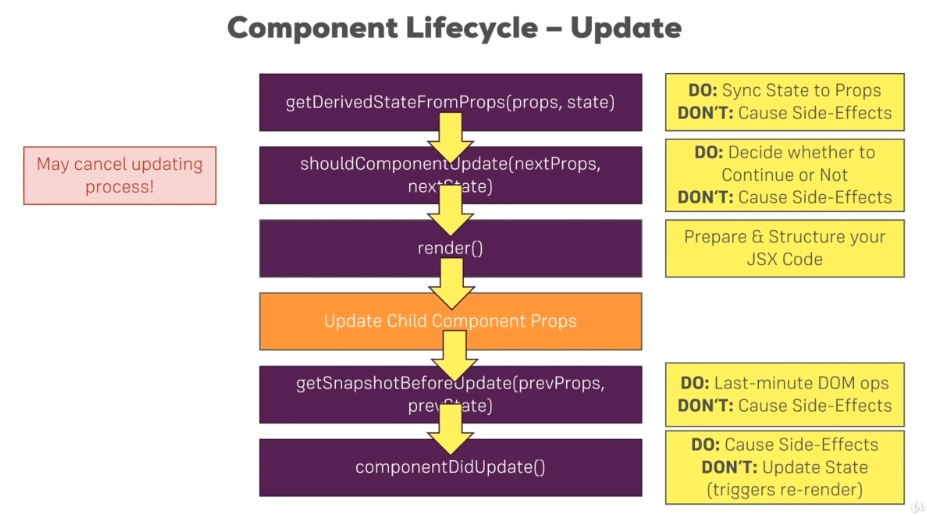

---
<a name="Back_To_Top"></a> Top
---

- ### [Splitting an App into Folders](#Splitting_an_App_into_Folders)
- ### [Splitting An App Into Components](#Splitting_An_App_Into_Components)
- ### [this.state vs this.props](#this.state_vs_this.props)
- ### [Component Lifecycle Overview](#Component_Lifecycle_Overview)
- ### [Component Lifecycle - Creation](#Component_Lifecycle_-_Creation)
- ### [Component Lifecycle - Update for PROP Changes](#Component_Lifecycle_-_Update_for_PROP_Changes)
- ### [Component Lifecycle - Update for STATE Changes](#Component_Lifecycle_-_Update_for_STATE_Changes)
- ### [Component Lifecycle - Cleaning Up](#Component_Lifecycle_-_Cleaning_Up)
- ### [When should you Optimize?](#When_should_you_Optimize?)
- ### [PureComponents instead of ShouldComponentUpdate](#PureComponents_instead_of_ShouldComponentUpdate)

---

## <a name="Splitting_an_App_into_Folders"></a>Splitting an App into Folders

Here we have restructured our application, to only have the `index.js` file directly in the source folder then have a list of the `containers` we know and then have a list of the `components` we know.


---

- [Top](#Back_To_Top)

---

## <a name="Splitting_An_App_Into_Components"></a>Splitting An App Into Components

> ### When working with React it is the best practise to use as many functional components as possible and to create granular pieces where each component has a clear focus.

Due to the ES6 features and our project setup its possible to shorten a function body to just return parenthesis containing your JSX code and omit the `return` statement. We also `import React from 'react';` in order to render JSX.

```js
import React from 'react';

const persons = (props) => (

);
```

For our `persons.js` component we know that props w ill contain an array of persons which we want to transform into an array of JSX elements just as we previously did in `app.js`. Since we are returning `Person` here we need to import that `Person` component. All thats left to do is to adjust the functions we are receiving as props.

> ### Notice how there is no wrapping div since we are returning multiple elements sitting next to eachother.

**src -> components -> Persons -> Persons.js**

```js
import React from 'react';

import Person from './Person/Person';

const persons = (props) => {
  console.log('[Persons.js] rendering...');
  return props.persons.map((person, index) => {
    return (
      // No wrapping div
      <Person
        click={() => props.clicked(index)}
        name={person.name}
        age={person.age}
        key={person.id}
        changed={(event) => props.changed(event, person.id)}
      />
    );
  });
};

export default persons;
```

The `Cockpit` component will be a functional component. Since we won't be managing state with `usestate` we are following th best practice of using as many functional components as possible. In the `Cockpit.js` we need a wrapping element since we are returning multiple elements in our root node.

> ### There are other ways to support not having to wrap our elements in a single root because _React 16_ offers us alternatives.

Here classes must be imported and we therefore needed to create a `Cockpit.css` file

**src -> components -> Cockpit -> Cockpit.js**

```js
import React from 'react';

import classes from './Cockpit.css';

const cockpit = (props) => {
  const assignedClasses = [];
  let btnClass = '';
  if (props.showPersons) {
    btnClass = classes.Red;
  }

  if (props.persons.length <= 2) {
    assignedClasses.push(classes.red); // classes = ['red']
  }
  if (props.persons.length <= 1) {
    assignedClasses.push(classes.bold); // classes = ['red', 'bold']
  }

  return (
    <div className={classes.Cockpit}>
      <h1>{props.title}</h1>
      <p className={assignedClasses.join(' ')}>This is really working!</p>
      <button className={btnClass} onClick={props.clicked}>
        Toggle Persons
      </button>
    </div>
  );
};

export default cockpit;
```

In our `App.js` file we need to include our Persons and our Cockpit imports.

- For the Persons component we must add three props: the `persons` prop, the `clicked` prop and the `changed` prop.
- For the Cockpit component we must add three props: the `showpersons` prop, the `persons` prop and the `clicked` prop.

With that we now have a clearly focused `App.js` file with the `Cockpit` and our `Persons` components array

**src -> containers -> App.js**

```js
import React, { Component } from 'react';

import classes from './App.css';
// Importing the Persons component
import Persons from '../components/Persons/Persons';
// Importing the Cockpit component
import Cockpit from '../components/Cockpit/Cockpit';

class App extends Component {
  constructor(props) {
    super(props);
    console.log('[App.js] constructor');
  }

  state = {
    persons: [
      { id: 'asfa1', name: 'Max', age: 28 },
      { id: 'vasdf1', name: 'Manu', age: 29 },
      { id: 'asdf11', name: 'Stephanie', age: 26 },
    ],
    otherState: 'some other value',
    showPersons: false,
  };

  static getDerivedStateFromProps(props, state) {
    console.log('[App.js] getDerivedStateFromProps', props);
    return state;
  }

  componentWillMount() {
    console.log('[App.js] componentWillMount');
  }

  componentDidMount() {
    console.log('[App.js] componentDidMount');
  }

  nameChangedHandler = (event, id) => {
    const personIndex = this.state.persons.findIndex((p) => {
      return p.id === id;
    });

    const person = {
      ...this.state.persons[personIndex],
    };

    // const person = Object.assign({}, this.state.persons[personIndex]);

    person.name = event.target.value;

    const persons = [...this.state.persons];
    persons[personIndex] = person;

    this.setState({ persons: persons });
  };

  deletePersonHandler = (personIndex) => {
    // const persons = this.state.persons.slice();
    const persons = [...this.state.persons];
    persons.splice(personIndex, 1);
    this.setState({ persons: persons });
  };

  togglePersonsHandler = () => {
    const doesShow = this.state.showPersons;
    this.setState({ showPersons: !doesShow });
  };

  render() {
    console.log('[App.js] render');
    let persons = null;

    if (this.state.showPersons) {
      persons = (
        // Passing the three props to our Persons component
        <Persons
          persons={this.state.persons}
          clicked={this.deletePersonHandler}
          changed={this.nameChangedHandler}
        />
      );
    }
    // Passing the three props to our Cockpit component
    return (
      <div className={classes.App}>
        <Cockpit
          title={this.props.appTitle}
          showPersons={this.state.showPersons}
          persons={this.state.persons}
          clicked={this.togglePersonsHandler}
        />
        {persons}
      </div>
    );
  }
}

export default App;
```

---

- [Top](#Back_To_Top)

---

- ### [Comparing Stateless & Stateful Components](#Comparing_Stateless_&_Stateful_Components)

## <a name="Comparing_Stateless_&_Stateful_Components"></a>Comparing Stateless & Stateful Components

> ### Its important to note that since React 16.8 stateful does not automatically mean class-based components, though historically this has been the case because React hooks like useState are a really new feature and therefore you will find plently of applications where state is only managed in class-based components.

It remains best practice to still have many presentational components in your app. Presentational components being functional components which don't manage state and even though you can manage state using the `useState` hook you should try to restrict yourself as much as possible to functional components which don't manage state. It is best to only have a couple of components managing state and depending on the size of your app, this could be hundreds of components.

> ### The more you work with React the more you'll get a feeling for which components should manage some state so that its child components get the right inputs and which components would be better be just presentational components.

By maintaining the split between container components (stateful components) and the presentational components (dumb components) you keep your app manageable because you have a predictable flow of data since you know where your state changes and the other components are only there to render a nice ui. These ui components only define on props and that ensures that these components are highly predictable. You can throw them anywhere into your application and they work if you pass the right inputs and as your application grows you have an easier time maintaining it.

### When should you use class-based components and when should you use functional-based components?


#### Working with a version of React which doesn't support React hooks

- When you're working with state or you need lifecycle hooks, use the class-based approach otherwise go functional.

#### Working with a version of React that supports React hooks

This is less simple.

- You might want to use functional components only.
- You can also split it to have a clear separation between components that are involved with state management and components that arnt.

---

- [Top](#Back_To_Top)

---

## <a name="this.state_vs_this.props"></a>this.state vs this.props

Thus far we've only accesed `this.state` in the `App.js` when we are passing our state as props to our child components. Our `App.js` file does not receive any props, but we can change this by sending a prop into our `App.js` component from the `index.js` file.

```js
import React from 'react';
import ReactDOM from 'react-dom';
import './index.css';
import App from './containers/App';
import registerServiceWorker from './registerServiceWorker';

ReactDOM.render(
  // Sending the appTitle prop into our App component
  <App appTitle="Person Manager" />,
  document.getElementById('root')
);
registerServiceWorker();
```

Lets pass the `appTitle` prop through to our `Cockpit` component in the `App.js` file.

**src -> containers -> App.js**

```js
<Cockpit
  title={this.props.appTitle}
  showPersons={this.state.showPersons}
  persons={this.state.persons}
  clicked={this.togglePersonsHandler}
/>
```

Access it in the Cockpit file.

**src -> components -> Cockpit -> Cockpit.js**

```js
<div className={classes.Cockpit}>
  <h1>{props.title}</h1>
  <p className={assignedClasses.join(' ')}>This is really working!</p>
  <button className={btnClass} onClick={props.clicked}>
    Toggle Persons
  </button>
</div>
```

---

- [Top](#Back_To_Top)

---

## <a name="Component_Lifecycle_Overview"></a>Component Lifecycle Overview

The component lifecycle is only available in class based components al though functional components with React hooks do have an equivalent.

> ### The naming can be confusing but "Lifecycle Hooks" have absolutely nothing to do with "React Hooks"!


> ### We've got these methods which we can add to any class-based component and React will execute them for us and they will run at different points of time for which we can do different things such as fetch data from the web or perform some cleanup work before a component is removed from the DOM.

### How exactly are these functions used and in which order do they execute?


1. When a component is created the **_`constructor(props)`_** executes first

- Not actually a lifecycle hook but a default ES6 class feature
- Used for basic initialization work such as setting initial state
- Avoid causing side effects such as sending requests/storing in local storage/sending analytics to Google analytics. These cause unncessary rerender cycles which should be avoided
- This constructor will receive the props of this component and you have to call `super(props)` in the constructor
- You don't have to add it just to make that call its done for you if you don't add it
- If you do add your own constructor where you want to execute your own logic, you need to call `super(props)` in there

2. Second, **_`getDerivedStateFromProps(props, state)`_** runs

- Not used often, very rare niche cases
- This is a lifecycle hook added with React 16.3
- Idea is that whenever your props change for your class-based component, you can sync your state to them
- If you have some scenario where props of your component can change and then you want to update some internal state of that component, this is the right lifecycle hook to use
- Avoid causing side effects in this lifecycle hook as well

3. Third, the **_`render()`_** method executes

- Use it only to prepare the data as you need it to lay out your JSX code
- Avoid causing side effects or setting timeouts which can block the rendering process

> ### When render runs and you do render any other components in your class-based component then these child components will now be rendered. Every child component you included in your rendered component here will then be rendered as well. Only once all these child components have rendered and their lifecycle hooks have finished your lifecycle hook here will finish for the creation when `componentDidMount()` gets called.

4. After all child components have rendered and the class based component is rendered, **_`componentDidMount()`_** gets called

- A very important lifecycle hook when you're working with class-based components
- Allows side effects such as http requests
- Avoid updating state using `setState({})` unless its in the then block of a promise after you sent an http request
- Do not call `setState({})` in here synchronously right after `componentDidMount` runs since it will trigger a re-render cycle that is bad for performance

## <a name="Component_Lifecycle_-_Creation"></a>Component Lifecycle - Creation

Lets work in our `App.js` file where we are using a class-based component which has access to lifecycle hooks.

1. The first thing that executes is the `constructor(props)`. The `constructor` receives some `props` and when you use a constructor you have to call `super(props)` in there. This will execute the constructor of the component you are extending to initialize everything correctly.

> ### In the constructor we can also initialize our state. Doing it below the constructor is a more modern feature which adds the constructor behind the scenes alternatively we can call `super(props)` and set the state up in the constructor.

```js
class App extends Component {
  constructor(props) {
    super(props);
    // Do not use this.setState(), instead use this.state since there will be no such state to merge with
    this.state = {
      persons: [
        { id: 'asfa1', name: 'Max', age: 28 },
        { id: 'asfa2', name: 'Warwick', age: 29 },
        { id: 'asfa3', name: 'Mientel', age: 58 },
      ],
    };
  }
}
```

2. After the constructor runs, `getDerivedStateFromProps(props, state)` gets executed and this is actually a `static` method. You will get your `props` and your `state` in here and you should return your updated state and you should return your updated state.

3. After `getDerivedStateFromProps` the `render()` method executes.

4. The `Persons` component will render, the individual `Person` components in that `Person` component will then render and once all of that is done `componentDidMount()` will run.

> ### Historically there were other hooks as well and these are still supported. One of these hooks was `componentWillMount()`. These hooks were very rarely used and could be used incorrectly. Generally what you would do here is preparing your state correctly and that is something you would do in getDerivedStateFromProps(props, state).

> ### Or, if you just want to set some initial state based on props, use the constructor!

Accessing the render method does not mean that the entire DOM gets rerendered, it simply wmeans that React will now re-render its internal virtual DOM and then check if the real DOM needs to be changed.

```js
import React, { Component } from 'react';

import classes from './App.css';
import Persons from '../components/Persons/Persons';
import Cockpit from '../components/Cockpit/Cockpit';

class App extends Component {
  // constructor executes first
  constructor(props) {
    super(props);
    console.log('[App.js] constructor');
  }

  state = {
    persons: [
      { id: 'asfa1', name: 'Max', age: 28 },
      { id: 'vasdf1', name: 'Manu', age: 29 },
      { id: 'asdf11', name: 'Stephanie', age: 26 },
    ],
    otherState: 'some other value',
    showPersons: false,
  };
  // getDerivedFromProps(props, state) executes second
  static getDerivedStateFromProps(props, state) {
    console.log('[App.js] getDerivedStateFromProps', props);
    return state;
  }
  // similar to getDerivedFromProps(props, state) - depricated
  componentWillMount() {
    console.log('[App.js] componentWillMount');
  }

  // componentDidMount() executes last
  componentDidMount() {
    console.log('[App.js] componentDidMount');
  }

  nameChangedHandler = (event, id) => {
    const personIndex = this.state.persons.findIndex((p) => {
      return p.id === id;
    });

    const person = {
      ...this.state.persons[personIndex],
    };

    person.name = event.target.value;

    const persons = [...this.state.persons];
    persons[personIndex] = person;

    this.setState({ persons: persons });
  };

  deletePersonHandler = (personIndex) => {
    // const persons = this.state.persons.slice();
    const persons = [...this.state.persons];
    persons.splice(personIndex, 1);
    this.setState({ persons: persons });
  };

  togglePersonsHandler = () => {
    const doesShow = this.state.showPersons;
    this.setState({ showPersons: !doesShow });
  };

  // render() method executes third
  render() {
    console.log('[App.js] render');
    let persons = null;

    if (this.state.showPersons) {
      persons = (
        <Persons
          persons={this.state.persons}
          clicked={this.deletePersonHandler}
          changed={this.nameChangedHandler}
        />
      );
    }

    return (
      <div className={classes.App}>
        <Cockpit
          title={this.props.appTitle}
          showPersons={this.state.showPersons}
          persons={this.state.persons}
          clicked={this.togglePersonsHandler}
        />
        {persons}
      </div>
    );
  }
}

export default App;
```

---

- [Top](#Back_To_Top)

---

## <a name="Component_Lifecycle_-_Update_for_PROP_Changes"></a>Component Lifecycle - Update for PROP Changes

Just as we have a lifecycle for the component creation, we also have one for updating components. So when props or state change which are the two triggers you have for a component to be re-evaluated by React, then we go through a different lifecycle.



### 1. This lifecycle then starts with **_`getDerivedStateFromProps(props, state)`_** being called

- Rarely used
- Use it to initialize the state of a component that updates based on props you're getting
- Its there for you to sync your local state inside of the component to your props you're getting
- That could be for example some form control which gets external properties and then you internally want to handle user input but initialize your state or update your state based on outside changes
- You should not cause side effects in here
- Often there is a more elegant way of updating your state or of managing your components based on external properties

### 2. Thereafter we reach **_`shouldComponentUpdate(nextProps, nextState)`_** and that is a very interesting hook

- Allows you to cancel the updating process
- You can decide whether or not React should continue evaluating and re-rendering the component
- Why? For performance optimization
- Should be used carefully because you can break your components if you block an update from happening incorrectly but it is very powerful since it allows you to also prevent unnecessary update
- You should not cause side effects in here

### 3. Now after that, the **_`render()`_** method is called

- React then goes through the JSX code, evaluates that and constructs its virtual DOM and sees if it needs to update the real DOM
- As always you prepare and structure your JSX code

Now React then goes ahead and updates all child components of this component, so it evaluates all the child components you have in your JSX code of this main component we're looking at here for which this lifecycle here runs and of course every child component then also goes through that lifecycle if it receives new props or state.

### 4. Now after that, we reach **_`getSnapshotBeforeUpdate(prevProps, prevState)`_**.

- Rarely used
- Takes the previous props and the previous state as input and that actually returns a snapshot object which you can freely configure
- Use it for last minute DOM operations - not changes but things like getting the current scrolling position of the user
- For example your upcoming update of your component will re-render the DOM and will add new elements on the DOM and you therefore want to restore the scrolling position of the user wants the update is done.

### 5. Last but not least once we're done with the update, **_`componentDidUpdate()`_**

- Signals that you are now done with the updating and that the render method has been executed
- Can use side effects
- Be careful not to enter infinite loop if you make an http request and you get back a response and you then update your component and then this cycle starts again
- What you shouldn't do here outside of the then block of a promise of an HTTP request is updating the state with set state.
- It's fine to do it as a result of some async task you're kicking off here but you should not call it synchronously in `componentDidUpdate()` because that will simply lead to an unnecessary re-render cycle.

> ### The hook you'll use by far most often will be componentDidUpdate which is after the update finished when you for example need to fetch new data from a server.

---

Let's start with the scenario that our props changed. To see these update lifecycle hooks in practice:

#### 1. I'll start with the static `getDerivedStateFromProps(props, state)` lifecycle hook again which gets props and state, should return a state and here I'll return the unchanged state and I don't even have a state here, so this will just be an empty object and I want to console.log persons.js getDerivedStateFromProps, like this.

#### 2. Thereafter, shouldComponentUpdate will run and shouldComponentUpdate gets the next props, so the upcoming props which will have an effect right after this update which is about to take place and the upcoming state as arguments and in here, now you actually have to return true or false - doing nothing is not an option.

> ### You have to return true if React should continue updating or false if it shouldn't.

Of course you don't typically hardcode this here but instead you add some condition where you compare the current props to your next props, to the upcoming props to find out if they changed and if they changed, you want to permit this. For now I will just return true here and console log persons.js shouldComponentUpdate.

#### 3. Next we have `getSnapshotBeforeUpdate` and there we get our previous props and we get our previous state and I will console log persons.js getSnapshotBeforeUpdate here.

#### 4. Now after that render will execute. Then the render cycle or the update cycle of all child components of this component will execute, so of all the person components in this case and thereafter, we'll have `componentDidUpdate()` and this will run once we're done with all the updating.

---

If I toggle persons, you see what happens is `getDerivedStateFromProps` runs again, then `render` and then you see here I get a warning that in my persons, I have `getDerivedStateFromProps` and in there, I am indeed returning a new state here but since I have an uninitialized state, it's not recommended using that lifecycle hook basically and therefore, you typically would want to get rid of that, I will do that to get rid of that warning. It's not an error but it again doesn't make sense to have it here if we don't do anything with that state and we don't even have an initial state.

> ### Once again `componentWillReceiveProps` and `componentWillUpdate()` are historic hooks which are depricated and not recommended.

Now what about `componentDidUpdate` though, where's that? Well it's nowhere to be seen because right now, we weren't in the update cycle of our persons component. `getDerivedStateFromProps` only ran because it's also part of the creation lifecycle. The update lifecycle of persons.js will run as soon as I, for example, type something here because then, we'll actually trigger, if you have a look at your input in person component, we'll trigger this onChange handler which triggers this props changed. This props changed in person.js here is forwarded to the changed prop of the persons component which is forwarded to our app.js file and in there if we have a look, changed calls the name changed handler and this updates our persons which we pass back in as a property to the persons component and therefore in this component. Now the updating lifecycle will begin because we forwarded that event from a child to the parent component to the app component. There we updated its state and then we got new data as a prop into this persons component and therefore this persons component lifecycle triggers as soon as we type.

**src -> components -> Persons -> Person -> Person.js**

```js
import React, { Component } from 'react';

import classes from './Person.css';

class Person extends Component {
  render() {
    console.log('[Person.js] rendering...');
    return (
      <div className={classes.Person}>
        <p onClick={this.props.click}>
          I'm {this.props.name} and I am {this.props.age} years old!
        </p>
        <p>{this.props.children}</p>
        <input
          type="text"
          onChange={this.props.changed}
          value={this.props.name}
        />
      </div>
    );
  }
}

export default Person;
```

**src -> components -> Persons -> Persons.js**

```js
import React, { Component } from 'react';

import Person from './Person/Person';

class Persons extends Component {
  // static getDerivedStateFromProps(props, state) {
  //   console.log('[Persons.js] getDerivedStateFromProps');
  //   return state;
  // }

  // componentWillReceiveProps(props) {
  //   console.log('[Persons.js] componentWillReceiveProps', props);
  // }

  shouldComponentUpdate(nextProps, nextState) {
    console.log('[Persons.js] shouldComponentUpdate');
    return true;
  }

  getSnapshotBeforeUpdate(prevProps, prevState) {
    console.log('[Persons.js] getSnapshotBeforeUpdate');
    return { message: 'Snapshot!' };
  }

  // componentWillUpdate() {
  // }

  componentDidUpdate(prevProps, prevState, snapshot) {
    console.log('[Persons.js] componentDidUpdate');
    console.log(snapshot);
  }

  render() {
    console.log('[Persons.js] rendering...');
    return this.props.persons.map((person, index) => {
      return (
        <Person
          click={() => this.props.clicked(index)}
          name={person.name}
          age={person.age}
          key={person.id}
          changed={(event) => this.props.changed(event, person.id)}
        />
      );
    });
  }
}

export default Persons;
```

**src -> containers -> App.js**

```js
import React, { Component } from 'react';

import classes from './App.css';
import Persons from '../components/Persons/Persons';
import Cockpit from '../components/Cockpit/Cockpit';

class App extends Component {
  constructor(props) {
    super(props);
    console.log('[App.js] constructor');
  }

  state = {
    persons: [
      { id: 'asfa1', name: 'Max', age: 28 },
      { id: 'vasdf1', name: 'Manu', age: 29 },
      { id: 'asdf11', name: 'Stephanie', age: 26 },
    ],
    otherState: 'some other value',
    showPersons: false,
  };

  static getDerivedStateFromProps(props, state) {
    console.log('[App.js] getDerivedStateFromProps', props);
    return state;
  }

  // componentWillMount() {
  //   console.log('[App.js] componentWillMount');
  // }

  componentDidMount() {
    console.log('[App.js] componentDidMount');
  }

  nameChangedHandler = (event, id) => {
    const personIndex = this.state.persons.findIndex((p) => {
      return p.id === id;
    });

    const person = {
      ...this.state.persons[personIndex],
    };

    // const person = Object.assign({}, this.state.persons[personIndex]);

    person.name = event.target.value;

    const persons = [...this.state.persons];
    persons[personIndex] = person;

    this.setState({ persons: persons });
  };

  deletePersonHandler = (personIndex) => {
    // const persons = this.state.persons.slice();
    const persons = [...this.state.persons];
    persons.splice(personIndex, 1);
    this.setState({ persons: persons });
  };

  togglePersonsHandler = () => {
    const doesShow = this.state.showPersons;
    this.setState({ showPersons: !doesShow });
  };

  render() {
    console.log('[App.js] render');
    let persons = null;

    if (this.state.showPersons) {
      persons = (
        <Persons
          persons={this.state.persons}
          clicked={this.deletePersonHandler}
          changed={this.nameChangedHandler}
        />
      );
    }

    return (
      <div className={classes.App}>
        <Cockpit
          title={this.props.appTitle}
          showPersons={this.state.showPersons}
          persons={this.state.persons}
          clicked={this.togglePersonsHandler}
        />
        {persons}
      </div>
    );
  }
}

export default App;
```

---

- [Top](#Back_To_Top)

---

## <a name="Component_Lifecycle_-_Update_for_STATE_Changes"></a>Component Lifecycle - Update for STATE Changes

Let's now also have a look at the lifecycle hook for internal changes when the state changes and we can do that with the help of `App.js` In there, we do change the state after someone adds something into one of the person inputs.

Remember `shouldComponentUpdate(nextState, nextProps)` has to return something and if you're returning undefined this is basically treated as `false` and therefore blocks the update. Thus, returning `false` is a way of preventing the update and returning `true` will allow the update. If this hook is not included, it will default to returning `true`.

> ### Important, `componentDidMount()`, `componentDidUpdate()` and also, for performance improvements, `shouldComponentUpdate(nextState, nextProps)` are the most important hooks.

- `componentDidMount()` & `componentDidUpdate()` you will typically do things like fetching new data from a server
- `shouldComponentUpdate(nextState, nextProps)` can be used for performance improvements

```js
import React, { Component } from 'react';

import classes from './App.css';
import Persons from '../components/Persons/Persons';
import Cockpit from '../components/Cockpit/Cockpit';

class App extends Component {
  constructor(props) {
    super(props);
    console.log('[App.js] constructor');
  }

  state = {
    persons: [
      { id: 'asfa1', name: 'Max', age: 28 },
      { id: 'vasdf1', name: 'Manu', age: 29 },
      { id: 'asdf11', name: 'Stephanie', age: 26 },
    ],
    otherState: 'some other value',
    showPersons: false,
  };

  static getDerivedStateFromProps(props, state) {
    console.log('[App.js] getDerivedStateFromProps', props);
    return state;
  }

  // componentWillMount() {
  //   console.log('[App.js] componentWillMount');
  // }

  componentDidMount() {
    // great hook for reaching out to a server
    console.log('[App.js] componentDidMount');
  }

  shouldComponentUpdate(nextProps, nextState) {
    console.log('[App.js] componentDidMount');
    // returning true to allow component updating, returning false here would prevent it
    return true;
  }

  componentDidUpdate() {
    // great hook for reaching out to a server
    console.log('[App.js] shouldComponentUpdate');
  }

  nameChangedHandler = (event, id) => {
    const personIndex = this.state.persons.findIndex((p) => {
      return p.id === id;
    });

    const person = {
      ...this.state.persons[personIndex],
    };

    person.name = event.target.value;

    const persons = [...this.state.persons];
    persons[personIndex] = person;

    this.setState({ persons: persons });
  };

  deletePersonHandler = (personIndex) => {
    // const persons = this.state.persons.slice();
    const persons = [...this.state.persons];
    persons.splice(personIndex, 1);
    this.setState({ persons: persons });
  };

  togglePersonsHandler = () => {
    const doesShow = this.state.showPersons;
    this.setState({ showPersons: !doesShow });
  };

  componentWillUnmount() {
    console.log('[Persons.js] componentWillUnmount');
  }

  render() {
    console.log('[App.js] render');
    let persons = null;

    if (this.state.showPersons) {
      persons = (
        <Persons
          persons={this.state.persons}
          clicked={this.deletePersonHandler}
          changed={this.nameChangedHandler}
        />
      );
    }

    return (
      <div className={classes.App}>
        <Cockpit
          title={this.props.appTitle}
          showPersons={this.state.showPersons}
          persons={this.state.persons}
          clicked={this.togglePersonsHandler}
        />
        {persons}
      </div>
    );
  }
}

export default App;
```

---

- [Top](#Back_To_Top)

---

## <a name="Component_Lifecycle_-_Cleaning_Up"></a>Component Lifecycle - Cleaning Up

Let's say in that scenario you want to cleanup some event listeners you've set up or in an app where you have a connection to a server its a very realistic scenario that you want to cleanup some stuff.

> ### In a class based component for this, you can add `componentWillUnmount()`.

Now in here, you could have any code that needs to run right before the component is removed, so right before you get rid of it.

_See code above._

---

- [Top](#Back_To_Top)

---

- ### [Using shouldComponentUpdate for Optimization](#Using shouldComponentUpdate for Optimization)

## <a name="Using shouldComponentUpdate for Optimization"></a>Using shouldComponentUpdate for Optimization

So whenever we change something in `app.js`, even if that only affects the `cockpit` or anything else in `app.js` but not `persons`, the `persons` child still gets re-rendered because that render function here gets called and therefore this whole function executes and React will go through that entire component tree, that is how it works and that is how it makes sense logically because this is a function, it gets executed from top to bottom.

> ### Now one important note about this check though, persons of course is an array and arrays just like objects in Javascript are reference types. In short, the idea here is that reference types, so arrays and objects, are stored in memory and what you actually store in variables and properties here are only pointers at that place in memory, so what we do compare here is actually the pointer. If something in that person component changed and the pointer is still the same, then this update wouldn't run and the only reason why it does run here is because in app.js when I do update my persons, like here with name changed handler, I do actually create a copy of the person I want to change and then I create a copy of that persons array and hence I create a new person object and a new array object and that occupies a new place in memory and gets a new pointer and therefore, the pointers now also differ.

#### In Chrome you can actually go to more tools and then rendering and there you can enable paint flashing. That can be useful because it allows you to see what really gets re-rendered because it's highlighted with a green look then.

There is a difference between how React updates the internal virtual DOM and how it then actually reaches out to the real DOM.

**src -> components -> Persons -> Persons.js**

```js
import React, { Component } from 'react';

import Person from './Person/Person';

class Persons extends Component {
  // static getDerivedStateFromProps(props, state) {
  //   console.log('[Persons.js] getDerivedStateFromProps');
  //   return state;
  // }

  // componentWillReceiveProps(props) {
  //   console.log('[Persons.js] componentWillReceiveProps', props);
  // }

  shouldComponentUpdate(nextProps, nextState) {
    console.log('[Persons.js] shouldComponentUpdate');
    // Allowing component update to only take place if props have changed, otherwise return false and no update takes place
    if (nextProps.persons !== this.props.persons) {
      return true;
    } else {
      return false;
    }
  }

  getSnapshotBeforeUpdate(prevProps, prevState) {
    console.log('[Persons.js] getSnapshotBeforeUpdate');
    return { message: 'Snapshot!' };
  }

  // componentWillUpdate() {
  // }

  componentDidUpdate(prevProps, prevState, snapshot) {
    console.log('[Persons.js] componentDidUpdate');
    console.log(snapshot);
  }

  render() {
    console.log('[Persons.js] rendering...');
    return this.props.persons.map((person, index) => {
      return (
        <Person
          click={() => this.props.clicked(index)}
          name={person.name}
          age={person.age}
          key={person.id}
          changed={(event) => this.props.changed(event, person.id)}
        />
      );
    });
  }
}

export default Persons;
```

---

- [Top](#Back_To_Top)

---

## <a name="When_should_you_Optimize?"></a>When should you Optimize?

1. Is this component part of a parent component that could change related to something that does not affect me at all?

Well then you should implement shouldComponentUpdate or React memo.

2. Otherwise if you're pretty sure that in all or almost all cases where your parent updates, you will need to update too

Then you should not add shouldComponentUpdate or React memo because you will just execute some extra logic that makes no sense and actually just slows down the application a tiny bit.

---

- [Top](#Back_To_Top)

---

## <a name="PureComponents_instead_of_ShouldComponentUpdate"></a>PureComponents instead of ShouldComponentUpdate

If you are checking all properties, then you can also not use `shouldComponentUpdate()` you can extend a `PureComponent`.

`PureComponent` in the end is just a normal component that already implements `shouldComponentUpdate()` with a complete props check that checks for any changes in any prop of that component. If that is what you need, you can also just use `PureComponent` instead of manually implementing this `shouldComponentUpdate()` check. The result will be the same, so you can do either of these but of course you can save some code if you use `PureComponent`.

```js
import React, { PureComponent } from 'react';

import Person from './Person/Person';

class Persons extends PureComponent {
  // static getDerivedStateFromProps(props, state) {
  //   console.log('[Persons.js] getDerivedStateFromProps');
  //   return state;
  // }

  // componentWillReceiveProps(props) {
  //   console.log('[Persons.js] componentWillReceiveProps', props);
  // }

  // shouldComponentUpdate(nextProps, nextState) {
  //   console.log('[Persons.js] shouldComponentUpdate');
  //   if (nextProps.persons !== this.props.persons) {
  //     return true;
  //   } else {
  //     return false;
  //   }
  // }

  getSnapshotBeforeUpdate(prevProps, prevState) {
    console.log('[Persons.js] getSnapshotBeforeUpdate');
    return { message: 'Snapshot!' };
  }

  // componentWillUpdate() {
  // }

  componentDidUpdate(prevProps, prevState, snapshot) {
    console.log('[Persons.js] componentDidUpdate');
    console.log(snapshot);
  }

  render() {
    console.log('[Persons.js] rendering...');
    return this.props.persons.map((person, index) => {
      return (
        <Person
          click={() => this.props.clicked(index)}
          name={person.name}
          age={person.age}
          key={person.id}
          changed={(event) => this.props.changed(event, person.id)}
        />
      );
    });
  }
}

export default Persons;
```

---

- [Top](#Back_To_Top)

---
