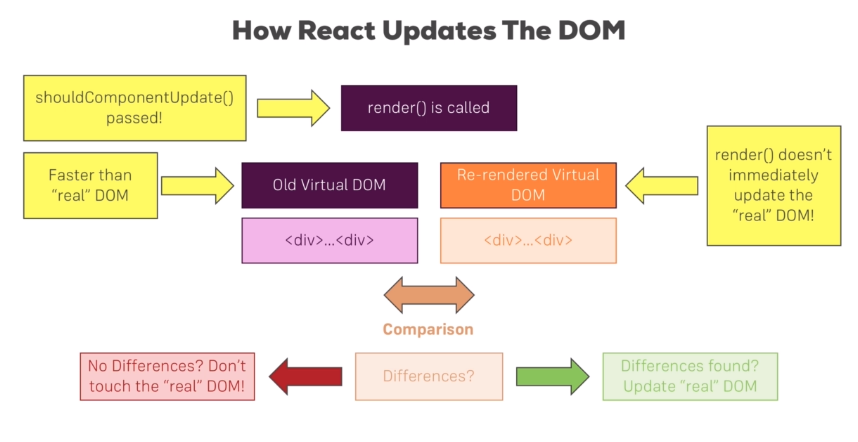

---
<a name="Back_To_Top"></a> Top
---

- ### [How React Updates the DOM](#How_React_Updates_the_DOM)
- ### [Rendering adjacent JSX Elements](#Rendering_adjacent_JSX_Elements)
- ### [Using React.Fragment (Built in Aux component)](<#Using_React.Fragment_(Built_in_Aux_component)>)
- ### [Higher Order Components (HOC) Method 1](<#Higher_Order_Components_(HOC)_Method_1>)
- ### [Higher Order Components (HOC) Method 2](<#Higher_Order_Components_(HOC)_Method_2>)
- ### [Passing Unknown Props](#Passing_Unknown_Props)
- ### [Setting state correctly](#Setting_state_correctly)
- ### [Using Refs](#Using_Refs)
- ### [Refs with React Hooks](#Refs_with_React_Hooks)
- ### [Using PropTypes](#Using_PropTypes)
- ### [Understanding Prop Chain Problems](#Understanding_Prop_Chain_Problems)
- ### [Using the Context API](#Using_the_Context_API)
- ### [contextType & useContext()](<#contextType_&_useContext()>)

---

## <a name="How_React_Updates_the_DOM"></a>How React Updates the DOM



- The `render()` method can be misleading, this does not mean that it renders it to the DOM. Render is more a suggestion of what the HTML should look like in the end but render can very well be called and lead to the same result as is already displayed and that is part of the reason why we use shouldComponentUpdate to prevent unnecessary render calls.

- Even if we don't catch an unnecessary render call, maybe a prop did change and still we would render the same result for whatever reason, even then this does not mean that it immediately hits the real DOM and starts re-rendering it, instead it first of all does something else, it compares virtual DOMs, It has an old virtual DOM and a re-rendered or a future virtual DOM. _React takes this virtual DOM approach because it's faster than the real DOM._ Now a virtual DOM simply is a DOM representation in Javascript.

- It has the old virtual DOM and then the re-rendered one, the re-rendered one is the one which gets created when the render method is called. Now as I mentioned though, re-rendering or calling render doesn't immediately update the real DOM, instead React makes a comparison. It compares the old virtual DOM to the new one and it checks if there are any differences.

- It compares the old virtual DOM to the new one and it checks if there are any differences. If it can detect differences, it reaches out to the real DOM and updates it and even then, it doesn't re-render the real DOM entirely, it only changes it in the places where differences were detected, for example if a button text changed, it will only update that text and not re-render the whole button.

- If no differences were found, then it doesn't touch the real DOM. Render did execute, the comparison was made and that is why `shouldComponentUpdate()` might make sense to prevent this.

> ### Accessing the DOM is really slow, this is something you want to do as little as possible and hence, React has this virtual DOM idea where it compares the virtual DOM and makes sure that the real DOM is only touched if needed.

---

- [Top](#Back_To_Top)

---

## <a name="Rendering_adjacent_JSX_Elements"></a>Rendering adjacent JSX Elements

You must only have one root JSX element, be that another component or a normal HTML element.

Now technically, an array of course still is one object but with multiple elements in there and indeed, React does allow us to return an array of adjacent elements _as long as all the items in there have a key_ and that key is required so that React can efficiently update and reorder these elements as it might be required by your app.

### Solution 1 [Array of JSX with a key]

I will return my JSX elements in an array separated by commas. Now this might look strange but remember, JSX is just syntactic sugar for React create element.
We can simply add a key on these elements and here we're not generating the key dynamically, we're not extracting a unique value from anywhere.

**src -> Components -> Persons -> Person -> Person.js**

```js
import React, { Component } from "react";
import classes from "./Person.css";

class Person extends Component {
  render() {
    console.log("[Person.js] rendering...");
    return [
      <p key="i1" onClick={this.props.click}>
        I'm {this.props.name} and I am {this.props.age} years old!
      </p>,
      <p key="i2">{this.props.children}</p>,
      <input
        key="i3"
        type="text"
        onChange={this.props.changed}
        value={this.props.name}
      />,
    ];
  }
}

export default Person;
```

> ### it's important to know that if you don't technically need a wrapping element for a styling or structural reasons, then you can avoid it by using an array.

### Solution 2 [Wrapping component]

You can create a wrapping component that does not render any actual HTML code but that simply is there to fulfill React's requirement of having a wrapping component.

I'll create a new folder which I'll name hoc which stands for a higher order component named `Aux` - this will need to be named `Auxilliary` on windows since `Aux` is a reserved word.

`children` is a special property that simply outputs whatever gets entered between the opening and closing tag of this component.

**Components -> hoc -> Aux.js**

```js
const aux = (props) => props.children;

export default aux;
```

It's basically an empty wrapper using that special children property which React reserves for us and children will always refer to the content between the opening and closing tag of your component.

**Components -> Persons -> Person -> Person.js**

```js
import React, { Component } from "react";

import Aux from "../../../hoc/Aux";
import classes from "./Person.css";

class Person extends Component {
  render() {
    console.log("[Person.js] rendering...");
    return (
      <Aux>
        <p onClick={this.props.click}>
          I'm {this.props.name} and I am {this.props.age} years old!
        </p>
        <p>{this.props.children}</p>
        <input
          type="text"
          onChange={this.props.changed}
          value={this.props.name}
        />
      </Aux>
    );
  }
}

export default Person;
```

---

- [Top](#Back_To_Top)

---

## <a name="Using_React.Fragment_(Built_in_Aux_component)"></a>Using React.Fragment (Built in Aux component)

Now since React 16.2, there is a built-in aux component, built into React so to say called `React.Fragment`.

> ### If you don't like that dot notation here, you can also simply import fragment from React like this, just as we're importing the component here and then you can just use fragment and it does exactly the same thing as our aux component does.

**src -> Components -> Persons -> Person -> Person.js**

```js
import React, { Component, Fragment } from "react";

import Aux from "../../../hoc/Aux";
import classes from "./Person.css";

class Person extends Component {
  render() {
    console.log("[Person.js] rendering...");
    return (
      <Fragment>
        <p onClick={this.props.click}>
          I'm {this.props.name} and I am {this.props.age} years old!
        </p>
        <p>{this.props.children}</p>
        <input
          type="text"
          onChange={this.props.changed}
          value={this.props.name}
        />
      </Fragment>
    );
  }
}

export default Person;
```

---

- [Top](#Back_To_Top)

---

## <a name="Higher_Order_Components_(HOC)_Method_1"></a>Higher Order Components (HOC) Method 1

It's kind of a convention to name higher order components with a `With` at the beginning, though of course ultimately it's up to you how you name your components.

> ### Some higher order components are **_introduced by third-party packages_** we'll be using and when you see them, remember what they do behind the scenes, they add something extra to the component. That could be styles, that could be HTML code or that could be some extra Javascript logic.

Lets create a root level higher order component with props managing our css modules which basically just sets up a class on a div.

**src -> hoc -> WithClass.js**

```js
import React from "react";

const withClass = (props) => (
  <div className={props.classes}>{props.children}</div>
);

export default withClass;
```

**src -> containers -> app.js**

```js
import WithClass from "../hoc/WithClass";

// Wrapping our JSX in the higher order component
return (
  <WithClass classes={classes.App}>
    <button
      onClick={() => {
        this.setState({ showCockpit: false });
      }}
    >
      Remove Cockpit
    </button>
    {this.state.showCockpit ? (
      <Cockpit
        title={this.props.appTitle}
        showPersons={this.state.showPersons}
        personsLength={this.state.persons.length}
        clicked={this.togglePersonsHandler}
      />
    ) : null}
    {persons}
  </WithClass>
);
```

---

- [Top](#Back_To_Top)

---

## <a name="Higher_Order_Components_(HOC)_Method_2"></a>Higher Order Components (HOC) Method 2

The other way does not work by returning a functional component here but instead by using a regular Javascript function.

- The first argument will actually be our wrapped component and you can name this whatever you want but it must start with a capital character because this will actually be a reference to a component.
- The second argument then is something that you need in your higher order component and of course that depends on which kind of higher order component you're creating and what your idea behind the higher order component could be.

_This higher order component has the purpose of adding a div with a certain CSS class around any element and therefore, getting that class name that should be added makes a lot of sense, of course you can also accept as many arguments as you want based on what your higher order component does._

**src -> hoc -> withClass.js**

```js
import React from "react";

const withClass = (WrappedComponent, className) => (
  return props => (
    <div className={className}>
      <WrappedComponent />
    </div>
  );
);

export default withClass;
```

_For the import we need to change it to a lowercase character because it's a normal function, a function that returns a component function but not a component itself. I will also rename the class name here to have a lowercase character to make this really clear that in this file, I have no functional component, that I have a normal function in there instead. And now in `app.js`, I of course need to adjust my import here too to import from `withClass` with the lowercase character._

**src -> containers -> app.js**

```js
// Importing Aux and the higher order component
import Aux from "../hoc/Aux";
import withClass from "../hoc/withClass";

return (
  <Aux>
    <button
      onClick={() => {
        this.setState({ showCockpit: false });
      }}
    >
      Remove Cockpit
    </button>
    {this.state.showCockpit ? (
      <Cockpit
        title={this.props.appTitle}
        showPersons={this.state.showPersons}
        personsLength={this.state.persons.length}
        clicked={this.togglePersonsHandler}
      />
    ) : null}
    {persons}
  </Aux>
);

// Passing in the higher order component
export default withClass(App, classes.App);
```

### Which method should you use?

- The first method is used to change the HTML code or change some styling and I would argue that those best go into your JSX code as a wrapping component, so method 1.

- The second method is good for behind the scenes logic like some Javascript code that handles errors or sends analytics data or anything like that. Such higher order components maybe should be used or should be written in this style here to really make it clear that they're not so much involved in the JSX code that gets rendered but in the logic that runs.

> ### As you see at this example, you can ultimately write any higher order component in any way. This is a semantical thing that ultimately is up to you.

---

- [Top](#Back_To_Top)

---

## <a name="Passing_Unknown_Props"></a>Passing Unknown Props

Now we can of course simply import `withClass` here from the higher order component folder and then the `withClass` file and then we can use this higher order component on the person component as well. It's not limited to being used in one component only, you can bring it into any component that needs the functionality this higher order component adds and the functionality this higher order component adds is that it adds a wrapping div with some CSS code.

**src -> components -> persons -> person -> person.js**

```js
import React, { Component } from "react";

import Aux from "../../../hoc/Aux";
import withClass from "../../../hoc/withClass";
import classes from "./Person.css";

class Person extends Component {
  render() {
    console.log("[Person.js] rendering...");
    return (
      <Aux>
        <p onClick={this.props.click}>
          I'm {this.props.name} and I am {this.props.age} years old!
        </p>
        <p key="i2">{this.props.children}</p>
        <input
          key="i3"
          type="text"
          onChange={this.props.changed}
          value={this.props.name}
        />
      </Aux>
    );
  }
}

export default withClass(Person, classes.Person);
```

`withClass` and let's pass the `person` component as the first argument and the class I want to add is `classes.person`, using the CSS modules and this person class here.

**src -> hoc -> withClass.js**

The data is missing because what we're doing is we're taking our person component and right before we export it, we pass it into the withClass function. The withClass function takes the component and outputs it, _but our component is missing all its props_. I'm outputting wrapped components like this and I haven't set any props here.

```js
import React from "react";

const withClass = (WrappedComponent, className) => {
  return (props) => (
    <div className={className}>
      <WrappedComponent {...props} />
    </div>
  );
};

export default withClass;
```

**src -> hoc -> Aux.js**

```js
const aux = (props) => props.children;

export default aux;
```

---

- [Top](#Back_To_Top)

---

## <a name="Setting_state_correctly"></a>Setting state correctly

Behind the scenes, set state does not immediately trigger an update of the state of this component in a re-render cycle, instead it's basically scheduled by React and React will then perform the state update and the re-render cycle when it has the available resources to do that, so when it basically decides that now is a good point of time to do that. Typically, that will of course be instantly especially in simple applications like this one but it's not guaranteed and I want you to memorize this because that is really important.

**src -> containers -> app.js**

```js
nameChangedHandler = (event, id) => {
  const personIndex = this.state.persons.findIndex((p) => {
    return p.id === id;
  });

  const person = {
    ...this.state.persons[personIndex],
  };

  person.name = event.target.value;

  const persons = [...this.state.persons];
  persons[personIndex] = person;

  this.setState({
    persons: persons,
    changeCounter: this.state.changeCounter + 1,
  });
};
```

Now when you're doing state updates that don't depend on the old state, there is nothing wrong with just passing the object, so without the change counter, this is perfect. With the change counter however, you should use that optional syntax where you actually receive two arguments and I'm using an anonymous arrow function here, where the first argument is your old state and I'll name it prev state for previous state and the second argument are your current props in case you need those.

**src -> containers -> app.js**

```js
nameChangedHandler = (event, id) => {
  const personIndex = this.state.persons.findIndex((p) => {
    return p.id === id;
  });

  const person = {
    ...this.state.persons[personIndex],
  };

  person.name = event.target.value;

  const persons = [...this.state.persons];
  persons[personIndex] = person;

  this.setState((prevState, props) => {
    return {
      persons: persons,
      changeCounter: prevState.changeCounter + 1,
    };
  });
};
```

---

- [Top](#Back_To_Top)

---

## <a name="Using_PropTypes"></a>Using PropTypes

It can help if you provide some instructions on which props these components accepts and which type of prop each prop should be. This is provided by the React community or by the official React team actually and it's not built into React core but it is part of React so to say, it's just an extra installation away because it's optional to use.

You can do this by importing or by installing an extra package, you do this with `npm install --save prop-types`

So in the component where you want to add some prop types annotations, you simply import prop types, recommended with an uppercase starting character but not strictly required, from prop-types.

This should now be a Javascript object and prop types is a special property which you add to any Javascript object or any Javascript component object, I should say, that React will watch out for in development mode and give you a warning if you then pass in incorrect props. Because in here, in this object, you now define which props this component uses and which type of data each component should be of.

> ### Whenever you have scenarios where other people are using your components and it might not be super clear which props your components take and which type of data goes into which prop, you should use proptypes.

**src -> components -> persons -> person -> person.js**

```js
import React, { Component } from "react";
import PropTypes from "prop-types";

import Aux from "../../../hoc/Aux";
import withClass from "../../../hoc/withClass";
import classes from "./Person.css";

class Person extends Component {
  render() {
    console.log("[Person.js] rendering...");
    return (
      <Aux>
        <p onClick={this.props.click}>
          I'm {this.props.name} and I am {this.props.age} years old!
        </p>
        <p key="i2">{this.props.children}</p>
        <input
          key="i3"
          type="text"
          onChange={this.props.changed}
          value={this.props.name}
        />
      </Aux>
    );
  }
}

// Specifying prop types

Person.propTypes = {
  click: PropTypes.func,
  name: PropTypes.string,
  age: PropTypes.number,
  changed: PropTypes.func,
};

export default withClass(Person, classes.Person);
```

---

- [Top](#Back_To_Top)

---

## <a name="Using_Refs"></a>Using Refs

React actually has an easier way for us to select an element, a concept called refs which stands for references.

`querySelector` is a general web or browser feature, a general DOM selector and it always works on the entire DOM, it doesn't care whether we use React or not and therefore, this is not the optimal way of selecting this. Sure we could set up an ID here to select it by ID but React actually has an easier way for us to select an element, a concept called **refs which stands for references**.

On any element and that does really mean not just on inputs but on any element including your own components, you can add a special `ref` keyword. Now `ref`, just like `key`, is a special property you can pass into any component, it is detected and understood by React.

### Method 1 (Only works in class components - Supported in older versions of React too)

You pass a function here and this can be an anonymous arrow function as I'm doing it here and the argument you're getting is a reference to the element you place this on, so here we could name this myInputEL but you can name it whatever you want. In that function body, you then can use that.

- Therefore here of course, we could call `.focus()` actually but that's not what I want to do here, instead let's say we want to use that in some other place of the application.

> ### You can add a new property to your class, so not to your state but really just to the class by using `this`, then any name of your choice whatever you want and this holds the myInputEL we're getting as an argument.

_So we're getting access to the input element here and then we're storing this in a global property. From this point on we can use it anywhere in our application._

**src -> components -> persons -> person -> person.js**

```js
import React, { Component } from "react";
import PropTypes from "prop-types";

import Aux from "../../../hoc/Aux";
import withClass from "../../../hoc/withClass";
import classes from "./Person.css";

class Person extends Component {
  componentDidMount() {
    this.myInputEL.focus();
  }

  render() {
    console.log("[Person.js] rendering...");
    return (
      <Aux>
        <p onClick={this.props.click}>
          I'm {this.props.name} and I am {this.props.age} years old!
        </p>
        <p key="i2">{this.props.children}</p>
        <input
          //  Setting up ref with anonymous arrow function
          ref={(inputEL) => {
            this.myInputEL = inputEL;
          }}
          key="i3"
          type="text"
          onChange={this.props.changed}
          value={this.props.name}
        />
      </Aux>
    );
  }
}

Person.propTypes = {
  click: PropTypes.func,
  name: PropTypes.string,
  age: PropTypes.number,
  changed: PropTypes.func,
};

export default withClass(Person, classes.Person);
```

### Method 2

Since React 16.3 we also have another way of setting up a reference and that includes the `constructor` or requires us to use the `constructor`.

You can now set up your input element, so the same property I'm using down there, input element by calling React create ref. So create ref is a method offered on the React object we're importing and I'm storing it here in the input element.

This is any reference object React gives me, whatever that is behind the scenes. You can now use this reference here and therefore I'll name it inputEl, element ref to make it really clear that this is just a reference, you can now use this here instead of passing a function to ref.

> ### The property you're initializing in the constructor holds access to this ref object React gives me. Then I'm assigning this to my ref property and behind the scenes, React will make the connection and `myInputELRef` will then actually allow me access to the element on which this ref assignment was placed.

So now in `componentDidMount()`, I can use this input element ref, so this ref property and there, I actually have a `current` property which you have to access first and this gives you access to your current reference. I'll access `current` and then `focus` on the current element stored in the reference.

**src -> components -> persons -> person -> person.js**

```js
import React, { Component } from "react";
import PropTypes from "prop-types";

import Aux from "../../../hoc/Aux";
import withClass from "../../../hoc/withClass";
import classes from "./Person.css";

class Person extends Component {
  // Setting up constructor and componentDidMount() hook

  constructor(props) {
    super(props);
    this.myInputELRef = React.createRef();
  }

  componentDidMount() {
    this.inputElementRef.current.focus();
  }

  render() {
    console.log("[Person.js] rendering...");
    return (
      <Aux>
        <p onClick={this.props.click}>
          I'm {this.props.name} and I am {this.props.age} years old!
        </p>
        <p key="i2">{this.props.children}</p>
        <input
          //  Setting up ref
          ref={this.myInputELRef}
          key="i3"
          type="text"
          onChange={this.props.changed}
          value={this.props.name}
        />
      </Aux>
    );
  }
}

Person.propTypes = {
  click: PropTypes.func,
  name: PropTypes.string,
  age: PropTypes.number,
  changed: PropTypes.func,
};

export default withClass(Person, classes.Person);
```

---

- [Top](#Back_To_Top)

---

## <a name="Refs_with_React_Hooks"></a>Refs with React Hooks

In a class-based component, we would have used `React.createRef()`. In a functional component this will not work instead here we have a hook we can use, the `useRef` hook.

So you import `useRef` from React.

The more common use case here for references is that you do get access to your DOM elements. So now we have our reference created with the help of the use ref hook now we can connect that in our DOM. Now therefore let's pass `null` as an initial value here and then let's go down to our DOM or to our JSX code to be precise, not the real DOM and here I want to pass a reference to this button.

If you call a `click` event right after I initialize the reference React won't have a chance of executing the code down there where I actually do assign this reference to the button and therefore at the point of time I'm calling click here, the button is of course undefined.

> ### We can change this with `useEffect` because what did you learn about `useEffect`? It basically runs after every render cycle. So the function you pass to `useEffect` does not run immediately, it runs after this JSX code here has been rendered for the first time and therefore `useEffect` here is a great place to actually call click. So therefore here in this `useEffect` where I pass an empty array as a second argument and which therefore only executes when the component renders the first time and then cleans up when it's unmounted. This is a good place to call a click event.

**src -> Components -> Cockpit -> Cockpit.js**

```js
// Importing the useRef hook
import React, { useEffect, useRef } from "react";

import classes from "./Cockpit.css";

const cockpit = (props) => {
  const toggleBtnRef = useRef(null);

  // Using our ref in useEffect (after jsx loaded)
  useEffect(() => {
    console.log("[Cockpit.js] useEffect");
    toggleBtnRef.current.click();
    return () => {
      console.log("[Cockpit.js] cleanup work in useEffect");
    };
  }, []);

  useEffect(() => {
    console.log("[Cockpit.js] 2nd useEffect");
    return () => {
      console.log("[Cockpit.js] cleanup work in 2nd useEffect");
    };
  });

  const assignedClasses = [];
  let btnClass = "";
  if (props.showPersons) {
    btnClass = classes.Red;
  }

  if (props.personsLength <= 2) {
    assignedClasses.push(classes.red); // classes = ['red']
  }
  if (props.personsLength <= 1) {
    assignedClasses.push(classes.bold); // classes = ['red', 'bold']
  }

  // Assigning the newly created ref to the button element
  return (
    <div className={classes.Cockpit}>
      <h1>{props.title}</h1>
      <p className={assignedClasses.join(" ")}>This is really working!</p>
      <button ref={toggleBtnRef} className={btnClass} onClick={props.clicked}>
        Toggle Persons
      </button>
    </div>
  );
};

export default React.memo(cockpit);
```

---

- [Top](#Back_To_Top)

---

## <a name="Understanding_Prop_Chain_Problems"></a>Understanding Prop Chain Problems

The persons component really only forwards the authentication status. It receives is authenticated as a prop but it doesn't really care and this is not so great because it simply leads to extra redundancy and it makes our components a bit less reusable because wherever we're using the persons component, we have to make sure we pass in is authenticated so that we can forward it and there, we have a feature called context which helps us solve the issue. Context was introduced by React and it helps us handle cases like this, where you need certain data, certain state in multiple components and you don't want to pass that state across multiple layers of components just to get it from component A at the top to component D at the very bottom when the components B, C in between don't really care about it and that's exactly the use case here. We want to skip the persons component and with the React context feature, we can do that.

---

- [Top](#Back_To_Top)

---

## <a name="Using_the_Context_API"></a>Using the Context API

---

- [Top](#Back_To_Top)

---

## <a name="contextType_&_useContext()"></a>contextType & useContext()

---

- [Top](#Back_To_Top)

---
