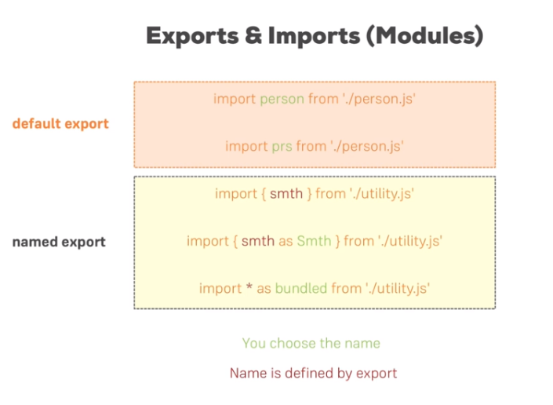

---
<a name="Back_To_Top"></a> Top
---

- ### [Routing and SPAs](#Routing_and_SPAs)
- ### [Setting Up The Router Package](#Setting_Up_The_Router_Package)
- ### [Settting Up and Rendering Routes](#Settting_Up_and_Rendering_Routes)
- ### [The withRouter HOC and Route Props](#The withRouter HOC and Route Props)
- ### [Absolute vs Relative paths](#Absolute_vs_Relatiev_paths)
- ### [Styling the active route](#Styling_the_active_route)
- ### [Passing Dynamic Route Parameters](#Passing_Dynamic_Route_Parameters)
- ### [Passing Query Parameters and the Fragment](#Passing_Query_Parameters_and_the_Fragment)
- ### [Using Switch to Load a Single Route](#Using_Switch_to_Load_a_Single_Route)

---

## <a name="Routing_and_SPAs"></a>Routing and SPAs

Routing is about being able to show different pages to the user. The trick just is that we don't actually have multiple html files, but then we instead use javascript to render different pages for different paths.


---

- [Top](#Back_To_Top)

---

## <a name="Setting_Up_The_Router_Package"></a>Setting Up The Router Package

`npm install --save react-router react-router-dom`

*We installed both react-router  and react-router-dom . Technically, only react-router-dom  is required for web development. It wraps react-router  and therefore uses it as a dependency.*

*We don't need to install react-router  on our own for it to work. You can omit this installation step, I left it in there for historic reasons and because I like to emphasize that the main package is named react-router. If you ever search for assistance, you probably want to search for "react router" - that's the name of the package.*

To enable routing we need to wrap the part of your app with a component you import from the react-react-router-dom package which should be able to render routes and to read routes. You can do it in both index.js and app.js,

**src -> App.js**

```js
import React, { Component } from 'react';
import { BrowserRouter } from 'react-router-dom';

import Blog from './containers/Blog/Blog';

class App extends Component {
  render () {
    return (
      <BrowserRouter>
        <div className="App">
          <Blog />
        </div>
      </BrowserRouter>
    );
  }
}

export default App;

```

---

- [Top](#Back_To_Top)

---

## <a name="Settting_Up_and_Rendering_Routes"></a>Settting Up and Rendering Routes

I need to import something else from the router package. So from react-router-dom again because it is related to rendering, from there I want to load the route object, the route component to be precise. Now we use it like any other component in our jsx code and it's a self-closing component. Route needs some configuration though, route needs a path property and all these props here I'm setting up are of course reserved words kind of, they are expected to be named like this by this component so you can't change the name and path simply is a string.

So when react router finds out that this is the active path. Now in its simplest form, you can now add a render prop which actually holds a reference to a function and you can pass an anonymous function an arrow function here. So here this function then has to return jsx which should be rendered, so you could simply render something like h1 tag where you say home and of course you can also render structured jsx here by wrapping it in parentheses and writing multi-line just like you write jsx anywhere else. 

> ### Alternatively you can pass a component to the `component` prop instead of using the `render` prop for the selected route.

We made sure that we can actually switch between pages but our application is constantly reloading and we don't want that. Now we want to make sure that we stay inside the application when clicking on links inside of it.

Now our state is contained, we don't reload the application and this is the way we should actually navigate around therefore, using the link component.

**src -> containers -> Blog -> Posts -> Blog.js**

```js
import React, { Component } from 'react';
// import axios from 'axios';
import { Route, Link } from 'react-router-dom';

import './Blog.css';
import Posts from './Posts/Posts';
import NewPost from './NewPost/NewPost';

class Blog extends Component {
    render () {
        return (
            <div className="Blog">
                <header>
                    <nav>
                        <ul>
                            <li><Link to="/">Home</Link></li>
                            <li><Link to={{
                                pathname: '/new-post',
                                hash: '#submit',
                                search: '?quick-submit=true'
                            }}>New Post</Link></li>
                        </ul>
                    </nav>
                </header>
                {/* <Route path="/" exact render={() => <h1>Home</h1>} />
                <Route path="/" render={() => <h1>Home 2</h1>} /> */}
                <Route path="/" exact component={Posts} />
                <Route path="/new-post" component={NewPost} />
            </div>
        );
    }
}

export default Blog;
```

---

- [Top](#Back_To_Top)

---


## <a name="The withRouter HOC and Route Props"></a>The withRouter HOC and Route Props

***History on container components***

The `history`, `location` and `match` properties is not something we set up, this is passed by react router.

Now match gives us some information about the matched route, you saw that we defined it to be exact the path and URL are found therefore and potential params, I'll come back to what params are later.

You get more information about the location and there you see for example the search params we set up or something like that at the hash fragment and the history. The history object also has some methods we can use like push to interact with that and push a new page programmatically without needing a link component,

**src -> containers -> Blog -> Posts -> Posts.js**

```js
import React, { Component } from 'react';
import axios from '../../../axios';

import Post from '../../../components/Post/Post';
import './Posts.css';

class Posts extends Component {
    state = {
        posts: []
    }

    componentDidMount () {
        // this.props will contain the object with the history location and match properties
        console.log(this.props);
        axios.get( '/posts' )
            .then( response => {
                const posts = response.data.slice(0, 4);
                const updatedPosts = posts.map(post => {
                    return {
                        ...post,
                        author: 'Max'
                    }
                });
                this.setState({posts: updatedPosts});
                // console.log( response );
            } )
            .catch(error => {
                console.log(error);
                // this.setState({error: true});
            });
    }

    postSelectedHandler = (id) => {
        this.setState({selectedPostId: id});
    }
    
    render () {
        let posts = <p style={{textAlign: 'center'}}>Something went wrong!</p>;
        if (!this.state.error) {
            posts = this.state.posts.map(post => {
                return <Post 
                    key={post.id} 
                    title={post.title} 
                    author={post.author}
                    clicked={() => this.postSelectedHandler(post.id)} />;
            });
        }

        return (
            <section className="Posts">
                {posts}
            </section>
        );
    }
}

export default Posts;
```

***History on child components of container components***

We can import something which is called withRouter from react-router-dom. Now withRouter is a higher order component which we use by wrapping our export with it, just like that. With this added, if we now save all files you see that now that the props are out for for the individual to use.

In the last video we learned about the props we can output, this utility information and regarding the history object, the utility methods even we can use to navigate around or find out where we are at. Now what if we actually want to get this information not in one of our containers, so not in a component which was loaded through a route as defined in the blog.js file but in a component which is rendered as part of such a container, like the Post's container.

**src -> components -> post -> Post.js**

```js
import React from 'react';
import { withRouter } from 'react-router-dom';

import './Post.css';

const post = (props) => (
    <article className="Post" onClick={props.clicked}>
        <h1>{props.title}</h1>
        <div className="Info">
            <div className="Author">{props.author}</div>
        </div>
    </article>
);

export default withRouter(post);
```

---

- [Top](#Back_To_Top)

---


## <a name="Absolute_vs_Relatiev_paths"></a>Absolute vs Relative paths

- Absolute paths will always be appended directly to the route domain... there are no nested paths. 

- Relative paths are paths which are nested after the root domain.

Remember that you have access to this.props.match, we inspected this in the console. The match object has the URL object which is the currently loaded path in the end. Now you can chain /new-post to this, you can build a dynamic path like this. Now it's a relative one because it takes the page you're currently on, the path you're currently on and appends this at the end and all of a sudden, you built a relative path.

**src -> containers -> Blog -> Posts -> Posts.js**

```js
import React, { Component } from 'react';
// import axios from 'axios';
import { Route, Link } from 'react-router-dom';

import './Blog.css';
import Posts from './Posts/Posts';
import NewPost from './NewPost/NewPost';

class Blog extends Component {
    render () {
        return (
            <div className="Blog">
                <header>
                    <nav>
                        <ul>
                            <li><Link to="/">Home</Link></li>
                            <li><Link to={{
                                // getting the current path from the match property
                                pathname: this.props.maths.url + '/new-post',
                                hash: '#submit',
                                search: '?quick-submit=true'
                            }}>New Post</Link></li>
                        </ul>
                    </nav>
                </header>
                {/* <Route path="/" exact render={() => <h1>Home</h1>} />
                <Route path="/" render={() => <h1>Home 2</h1>} /> */}
                <Route path="/" exact component={Posts} />
                <Route path="/new-post" component={NewPost} />
            </div>
        );
    }
}

export default Blog;
```

---

- [Top](#Back_To_Top)

---

## <a name="Styling_the_active_route"></a>Styling the active route

Behind the scenes the link is an anchor tag which is managed by the react router preventing the default which would be to really send that request. But you also see that there is no class being added to it even though that technically right now is still active page. So what we have to do is we manually have to tell react router to do so and we do this by not using a link but a different type of link, the nav link component. It's pretty similar to link but it has some extra props which allow us to define some styling for the active link. Let's replace this `link` with `navLink` and make sure to import it as I just did.

Now if you go back to the application, you see the inspect element which is the link here at the top for the active route which is new-post in my case has changed, there is an active class added now, this css class wasn't present before. This of course now allows us to apply some styling. So in blog.css, I can simply add a new rule and not only change the link color to orange if we're hovering over it or clicking on it but also for all links which have the active class.

We can manually override the `active` className by using the `activeClassName` prop on the link we want to change.

Furthermore we can also setup some additional inline styling by setting up the `activeStyle` and assigning it a JS object with some styles.

**src -> containers -> Blog -> Posts -> Posts.js**

```js
import React, { Component } from 'react';
// import axios from 'axios';
import { Route, Link, NavLink } from 'react-router-dom';

import './Blog.css';
import Posts from './Posts/Posts';
import NewPost from './NewPost/NewPost';

class Blog extends Component {
    render () {
        return (
            <div className="Blog">
                <header>
                    <nav>
                        <ul>
                            <li><NavLink to="/">Home</NavLink></li>
                            <li><NavLink 
                            activeClassName="my-active"
                            activeStyle={{
                              color: '#fa923f'
                              }}
                            to={{
                                pathname: '/new-post',
                                hash: '#submit',
                                search: '?quick-submit=true'
                            }}>New Post</NavLink></li>
                        </ul>
                    </nav>
                </header>
                {/* <Route path="/" exact render={() => <h1>Home</h1>} />
                <Route path="/" render={() => <h1>Home 2</h1>} /> */}
                <Route path="/" exact component={Posts} />
                <Route path="/new-post" component={NewPost} />
            </div>
        );
    }
}

export default Blog;
```

---

- [Top](#Back_To_Top)

---


## <a name="Passing_Dynamic_Route_Parameters"></a>Passing Dynamic Route Parameters 

It's easy to create dynamic route parameters by appending a `/:` followed by the name of the dynamic property you want to add such as `/:id`. 

> ### Its important to place any other route before the dynamic route to prevent them from being misinterpreted as the dynamic route. So the dynamic routes should always come last in the list.

**src -> containers -> Blog -> Posts -> Posts.js**

```js
import React, { Component } from 'react';
import axios from '../../../axios';

import Post from '../../../components/Post/Post';
import './Posts.css';

class Posts extends Component {
    state = {
        posts: []
    }

    componentDidMount () {
        console.log(this.props);
        axios.get( '/posts' )
            .then( response => {
                const posts = response.data.slice(0, 4);
                const updatedPosts = posts.map(post => {
                    return {
                        ...post,
                        author: 'Max'
                    }
                });
                this.setState({posts: updatedPosts});
                // console.log( response );
            } )
            .catch(error => {
                console.log(error);
                // this.setState({error: true});
            });
    }

    postSelectedHandler = (id) => {
        this.setState({selectedPostId: id});
    }
    
    render () {
        let posts = <p style={{textAlign: 'center'}}>Something went wrong!</p>;
        if (!this.state.error) {
            posts = this.state.posts.map(post => {
              // Remember that in the post component where we are looping over all of our elements, <Link> is now the outer element and it therefore needs to hold the key property
                return ( 
                  <Link to={'/' + post.id} key={post.id}>
                    <Post 
                    title={post.title} 
                    author={post.author}
                    clicked={() => this.postSelectedHandler(post.id)} />;
                  </Link> );
            }); 
        }  

        return (
            <section className="Posts">
                {posts}
            </section>
        );
    }
}

export default Posts;
```

Into `componentDidMount` because now we're not updating this, it's getting added or removed to and from the dom, so this needs to be a componentDidMount. if we do that then we see the object in our post component and they're under match, we see that in params, we have the ideal param and it's called ID because that is the name we set up as the name for this flexible element in this route definition in the blog component. Now of course that allows us to extract this then so here we can not only log it we can also access `this.props.match.params.id` and we know it will be there because this component is only loaded through this route which defines this id param.

**src -> containers -> Blog -> Posts -> FullPost.js**

```js
import React, {
    Component
} from 'react';
import axios from 'axios';

import './FullPost.css';

class FullPost extends Component {
    state = {
        loadedPost: null
    }

    componentDidUpdate() {
        // Accessing the dynamic property on the route via the match object
        if (this.props.match.params.id) {
            if (!this.state.loadedPost || (this.state.loadedPost && this.state.loadedPost.id !== this.props.id)) {
                axios.get('/posts/' + this.props.match.params.id)
                    .then(response => {
                        this.setState({
                            loadedPost: response.data
                        });
                    });
            }
        }
    }

    deletePostHandler = () => {
        axios.delete('/posts/' + this.props.id)
            .then(response => {
                console.log(response);
            });
    }

    render() {
        let post = < p style = {
            {
                textAlign: 'center'
            }
        } > Please select a Post! < /p>;
        if (this.props.id) {
            post = < p style = {
                {
                    textAlign: 'center'
                }
            } > Loading...! < /p>;
        }
        if (this.state.loadedPost) {
            post = ( <
                div className = "FullPost" >
                <
                h1 > {
                    this.state.loadedPost.title
                } < /h1> <
                p > {
                    this.state.loadedPost.body
                } < /p> <
                div className = "Edit" >
                <
                button onClick = {
                    this.deletePostHandler
                }
                className = "Delete" > Delete < /button> <
                /div> <
                /div>

            );
        }
        return post;
    }
}

export default FullPost;
```

## <a name="Passing_Query_Parameters_and_the_Fragment"></a>Passing Query Parameters and the Fragment

You learned how to extract route parameters (`=> :id  etc`). How do you extract search (also referred to as "query") parameters (`=> ?something=somevalue` at the end of the URL)? 

You can pass them easily like this:

`<Link to="/my-path?start=5">Go to Start</Link>`

or

```js
<Link 
    to={‌{
        pathname: '/my-path',
        search: '?start=5'
    }}
    >Go to Start</Link>
```

React router makes it easy to get access to the search string: props.location.search . But that will only give you something like ?start=5  You probably want to get the key-value pair, without the ?  and the = . Here's a snippet which allows you to easily extract that information:

```js
componentDidMount() {
    const query = new URLSearchParams(this.props.location.search);
    for (let param of query.entries()) {
        console.log(param); // yields ['start', '5']
    }
}
```

`URLSearchParams`  is a built-in object, shipping with vanilla JavaScript. It returns an object, which exposes the `entries()`  method. `entries()`  returns an Iterator - basically a construct which can be used in a for...of...  loop (as shown above).

When looping through `query.entries()` , you get arrays where the first element is the key name (e.g. start ) and the second element is the assigned value (e.g. 5 ).

***Fragment***

You can pass it easily like this:

`<Link to="/my-path#start-position">Go to Start</Link>`

or

```js
<Link 
    to={‌{
        pathname: '/my-path',
        hash: 'start-position'
    }}
    >Go to Start</Link>
```

React router makes it easy to extract the fragment. You can simply access `props.location.hash`.

---

- [Top](#Back_To_Top)

---

## <a name="Using_Switch_to_Load_a_Single_Route"></a>Using Switch to Load a Single Route

We can still tell react router to load only one of all these routes at a time, by wrapping our route config here with another component provided by the react-router-dom package, this switch component. Switch tells the react router, hey please only load one of the routes. The first one actually you find that matches from a given set of routes.

---

- [Top](#Back_To_Top)

---

- ### [1 TEMPLATE](#1_TEMPLATE)

## <a name="1_TEMPLATE"></a>1 TEMPLATE



[Table Lookups -> nwId](https://github.com/WNortier/nextworld/blob/master/nextworld-platform-tutorials/01-build-an-application/00-build-an-application-overview.md#3_TABLE_LOOKUPS)
